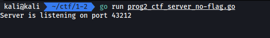
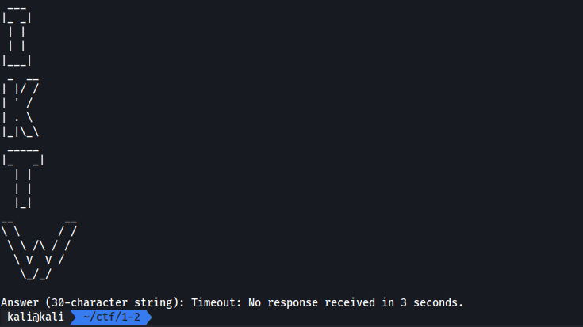
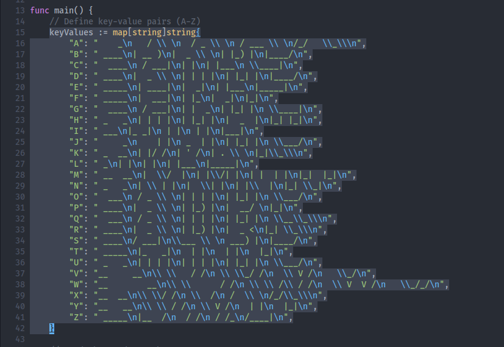
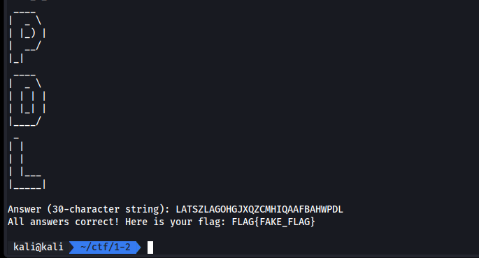

# ASCII CAPTCHA

Tag : `programming`

ปัญหาในโจทย์ข้อนี้คล้ายๆกับข้อ [Half Search Game](./half-search-game.md) ที่ต้องเขียนโปรแกรม connect ไปที่ target เพื่อ solve ปัญหา

สำหรับโจทย์นี้เราต้องทำการตอบว่า 30 ตัวอักษรที่อยู่ในรูป ASCII Art คือตัวอักษรอะไรบ้าง ซึ่งจำกัดเวลา 3 วินาที และสุ่มใหม่ทุกครั้งที่เล่น และในโจทย์นี้เรายังได้ source code มาเหมือนเดิม

[prog2_ctf_server_no-flag.zip](./files/prog2_ctf_server_no-flag.zip)

## Server



## Client



## Solving



จาก source code จุดที่น่าสนใจคือ map ที่เก็บ character และ character ที่อยู่ในรูป ASCII Art ไว้ ซึ่งเราจะเอาไปใช้ประโยชน์ในภายหลัง

ภาพจากที่อยู่ [Client](#client) เราจะสังเกตุได้ว่าอักษรที่เป็น ASCII Art นั้นสูงคงที่ คือ 5 บรรทัด ดังนั้นบรรทัดทั้งหมดที่ได้รับ server หลัง connect คือ $l=(n*5)+2$ โดยที่ $l$ คือจำนวนบรรทัด และ $n$ คือจำนวนตัวอักษร ส่วนการบวก 2 คือบรรทัดว่าง + บรรทัดแสดงคำถาม

เราจะทำการเขียน script สำหรับแก้ปัญหานี้ด้วย python โดยการ connect ไปที่ target แล้วเมื่อได้รับคำถามแล้วเราจะสนใจแค่ 150 บรรทัดแรก แล้วเราก็ทำการแยกเป็นกลุ่มตามลำดับ กลุ่มละ 5 บรรทัด เสร็จแล้วทำการ join เข้าด้วย newline และแทรก newline บรรทัดสุดท้าย (เนื่องจาก map ของ server มี newline ต่อท้าย) แล้วทำการ map แต่ละบรรทัดว่าตรงกับตัวอักษรอะไร แล้วทำการส่งกลับ server เพื่อตอบ

```py
import socket

HOST = "localhost"
PORT = 43212

map_ = {
    "A": "    _\n   / \\ \n  / _ \\ \n / ___ \\ \n/_/   \\_\\\n",
    "B": " ____\n| __ )\n|  _ \\ \n| |_) |\n|____/\n",
    "C": "  ____\n / ___|\n| |\n| |___\n \\____|\n",
    "D": " ____\n|  _ \\ \n| | | |\n| |_| |\n|____/\n",
    "E": " _____\n| ____|\n|  _|\n| |___\n|_____|\n",
    "F": " _____\n|  ___|\n| |_\n|  _|\n|_|\n",
    "G": "  ____\n / ___|\n| |  _\n| |_| |\n \\____|\n",
    "H": " _   _\n| | | |\n| |_| |\n|  _  |\n|_| |_|\n",
    "I": " ___\n|_ _|\n | |\n | |\n|___|\n",
    "J": "     _\n    | |\n _  | |\n| |_| |\n \\___/\n",
    "K": " _  __\n| |/ /\n| ' /\n| . \\ \n|_|\\_\\\n",
    "L": " _\n| |\n| |\n| |___\n|_____|\n",
    "M": " __  __\n|  \\/  |\n| |\\/| |\n| |  | |\n|_|  |_|\n",
    "N": " _   _\n| \\ | |\n|  \\| |\n| |\\  |\n|_| \\_|\n",
    "O": "  ___\n / _ \\ \n| | | |\n| |_| |\n \\___/\n",
    "P": " ____\n|  _ \\ \n| |_) |\n|  __/ \n|_|\n",
    "Q": "  ___\n / _ \\ \n| | | |\n| |_| |\n \\__\\_\\\n",
    "R": " ____\n|  _ \\ \n| |_) |\n|  _ <\n|_| \\_\\\n",
    "S": " ____\n/ ___|\n\\___ \\ \n ___) |\n|____/\n",
    "T": " _____\n|_   _|\n  | |\n  | |\n  |_|\n",
    "U": " _   _\n| | | |\n| | | |\n| |_| |\n \\___/\n",
    "V": "__     __\n\\ \\   / /\n \\ \\_/ /\n  \\ V /\n   \\_/\n",
    "W": "__        __\n\\ \\      / /\n \\ \\ /\\ / /\n  \\ V  V /\n   \\_/_/\n",
    "X": "__  __\n\\ \\/ /\n \\  /\n /  \\ \n/_/\\_\\\n",
    "Y": "__   __\n\\ \\ / /\n \\ V /\n  | |\n  |_|\n",
    "Z": " _____\n|__  /\n  / /\n / /_\n/____|\n",
}

for c in map(chr, range(ord("A"), ord("Z") + 1)):
    map_[map_[c]] = c
    del map_[c]

with socket.socket(socket.AF_INET, socket.SOCK_STREAM) as sock:
    sock.connect((HOST, PORT))
    data = sock.recv(4096).decode()
    print(data, end="")
    lines = data.splitlines()
    group = []
    for i in range(30):
        group.append([])
        for j in range(5):
            group[i].append(lines[(i * 5) + j])
        group[i] = "\n".join(group[i]) + "\n"
        group[i] = map_[group[i]]
    ans = "".join(group)
    print(ans)
    sock.send((ans + "\n").encode())
    res = sock.recv(4096).decode()
    print(res)
```

## Result


