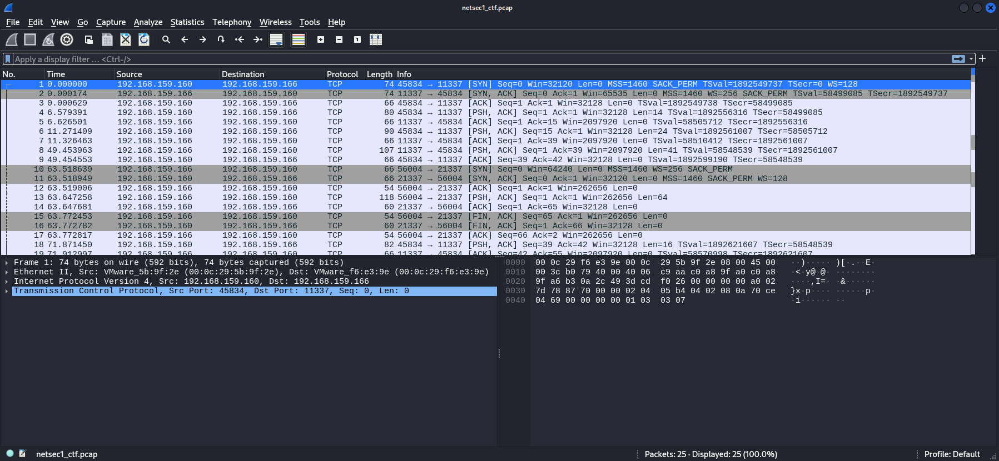
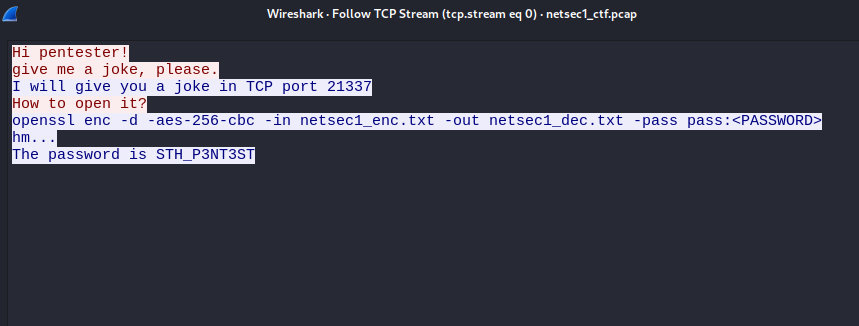
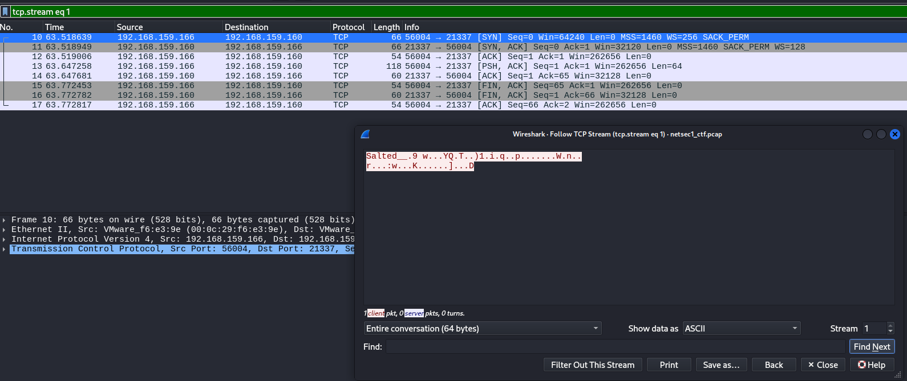
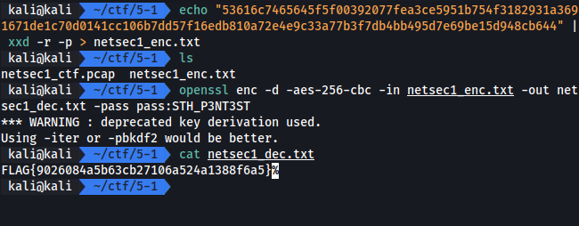

# Chat Message

Tag: `network` `cryptography`

เราต้องหา flag จากการถอดรหัสไฟล์ ซึ่งได้จากการดัก traffic

## Screen

## Solving

เริ่มจากการ follow tcp stream แล้วพบว่าเป็นการคุยกันผ่าน tcp และมี password และ command ของ openssl ติดมาด้วย พร้อมบอกว่า มุขนั้นอยู่ที่ไหน

เราจึงไปตามยัง port แล้วเมื่อ follow tcp stream ดังกล่าวแล้วพบว่าเป็นข้อความเข้ารหัสไว้

จากสรุปได้ว่า ในตอนแรกและตอนที่สอง คือ เราจะต้องเอาข้อความจาก port ที่ตามมาไปเขียนลงไฟล์ แล้วทำการถอดรหัสด้วย password และคำสั่งที่ได้ในตอนแรก

## Result

