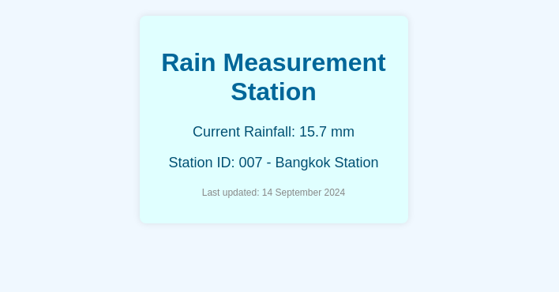
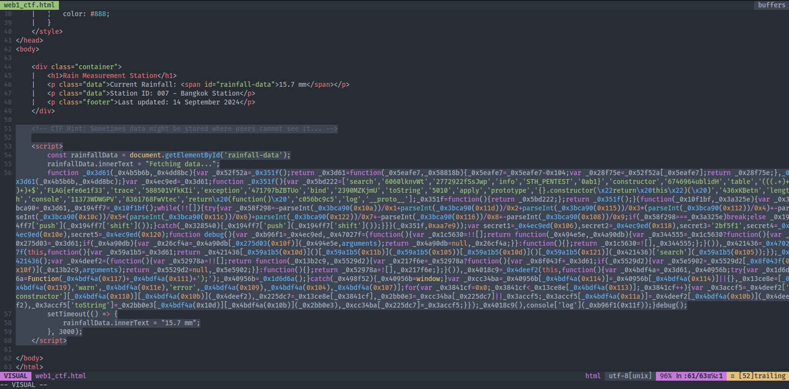
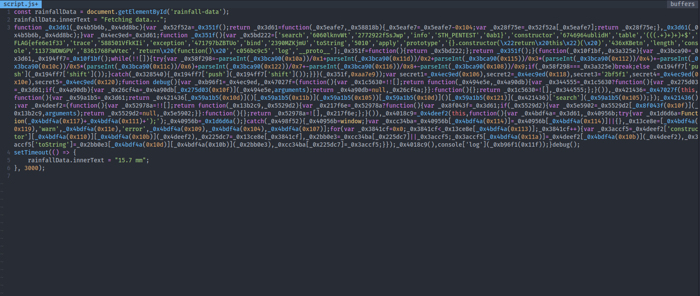
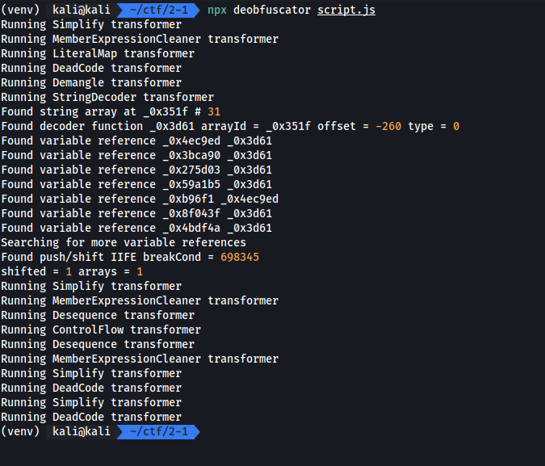
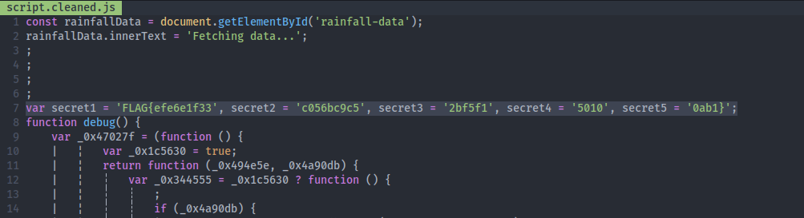

# Decoding the Storm

Tag: `web` `obfuscate`

เราได้ไฟล์ html โดยเราต้องหา flag ในเว็บนี้

[web1_ctf.zip](./files/web1_ctf.zip)

## Screen

## Solving

เมื่อเราได้เปิดดู html แล้วพบว่ามีจุดหนึ่งใน code พร้อมกับ hit ที่บอกว่าข้อมูลอยู่ในรูปอะไร ซึ่งถ้ามองด้วยตาปล่าวจะรู้ว่ามันคือ code ที่ถูก obfuscate

เราจึงได้แยก javascript ดังกล่าวออกมา

ทำการ deobfuscate

## Result

