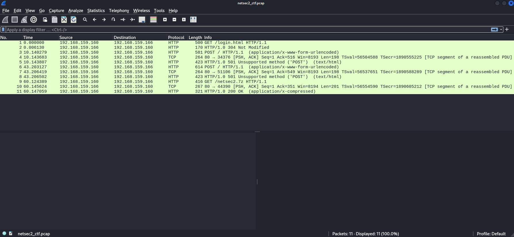
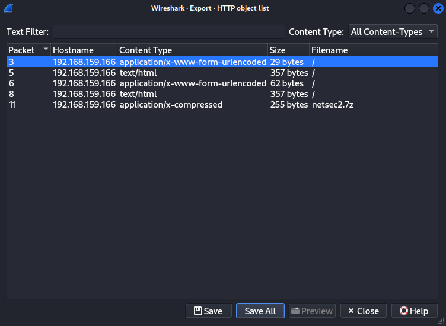
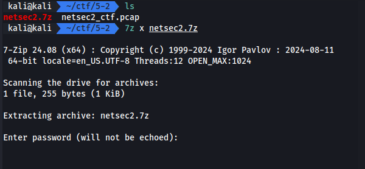
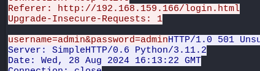
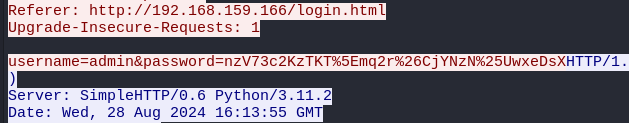
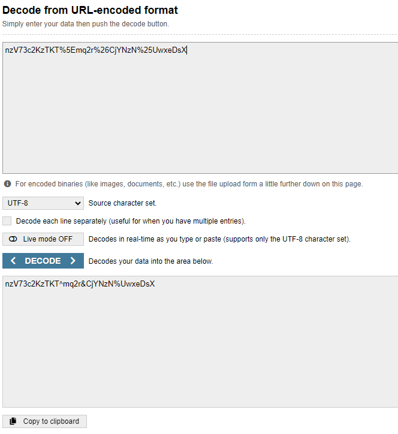
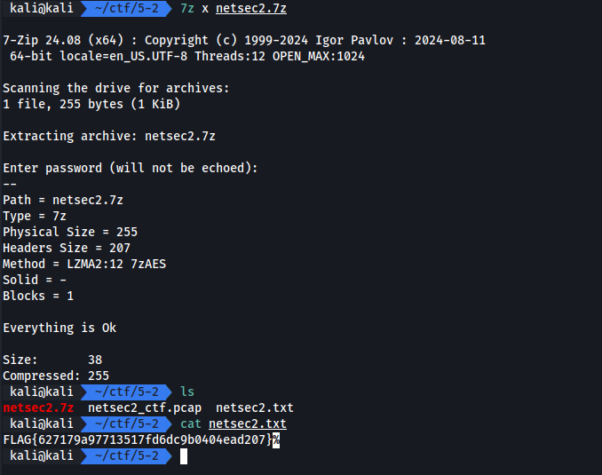

# Encrypted File

Tag: `network`

ในโจทย์นี้เราได้ไฟล์ pcap มา ซึ่งเราต้องหา 7z ในนั้นและ password สำหรับแตกไฟล์

[netsec2_ctf.zip](./files/netsec2_ctf.zip)

## Screen

## Solving

เริ่มจากการ export เอา 7z ออกมาก่อนเลย

พบว่ามี password จริงๆ

เราจึงไล่ดู HTTP แต่ละ request ว่ามีอะไรน่าจะเป็น password ได้บ้างแล้วพบว่ามี 2 request ที่น่าสนใจ

แต่พอเรานำ password ทั้งสองไปทดสอบพบว่าใช้ไม่ได้

แต่เดี๋ยวก่อน HTTP ส่วนหัวไม่สามารถส่งอักษรพิเศษตรงๆได้ ต้อง encode ก่อน เราจะสังเกตุได้จากมี % ตรง password ที่สอง

เราจึงทดลองนำไป decode แล้วแตกไฟล์ใหม่อีกครั้ง

## Result

