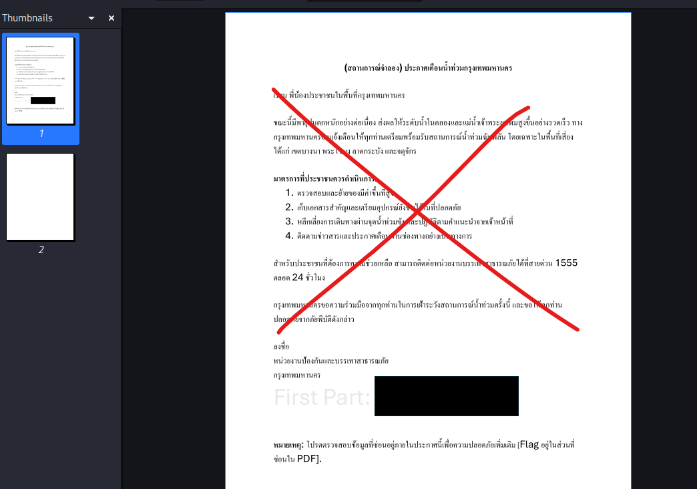
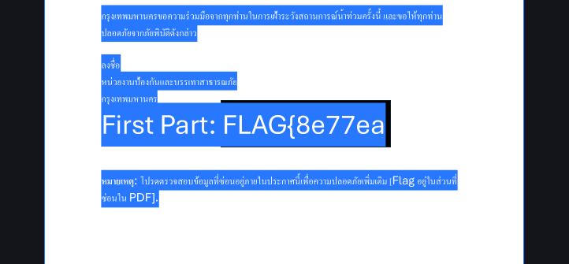
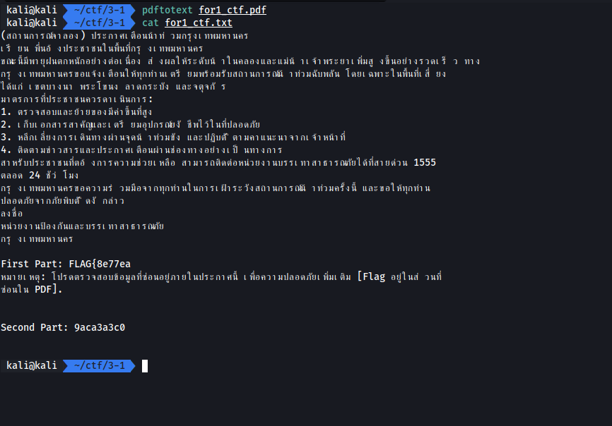
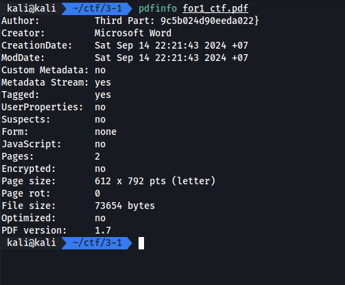

# Flood Alert

Tag: `forensics`

เราต้องหา flag ในไฟล์ pdf

[netsec1_ctf.zip](./files/netsec1_ctf.zip)

## Screen

## Solving

สำหรับโจทย์ข้อนี้เราสามารถหาสองส่วนแรกได้ง่ายๆ 2 วิธีคือ

- Ctrl + A แล้วจะเจอทันที
- ใช้ PDF to Text

ปัญหาของมันคือตัว text ถูกซ่อนด้วยการกำหนดสี font จึงทำให้มองไม่เห็น

ส่วนสุดท้ายอยู่ใน info

## Result

### 1+2 - Ctrl + A

ครึ่งหลังอยู่หน้าที่สอง

### 1+2 PDF to Text (poppler-utils)

### 3 - (pdfinfo)

