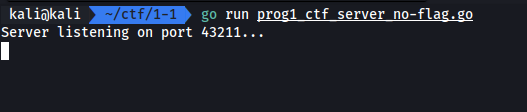
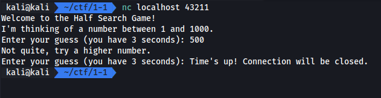
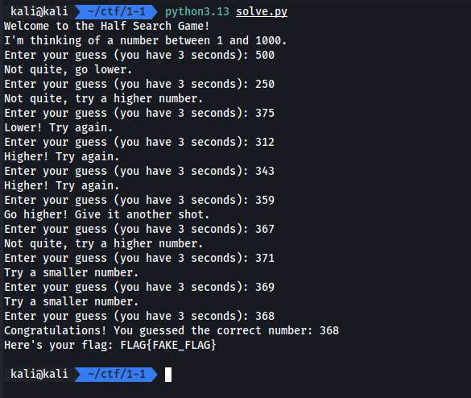

# Half Search Game

Tag: `programming`

ปัญหาของมันคือ เราต้อง connect ไปที่ ip:port ที่กำหนดมาให้ เราต้องเดาว่าเลขที่ถูกต้องจากการสุ่มคือเลขอะไร โดยเราจะต้องตอบให้ได้ภายใน 3 วิ และไม่เกิน 10 ครั้ง โดยทุกครั้งที่ตอบจะได้คำใบ้เพื่อให้เราขยับเข้าใกล้คำตอบได้ ในโจทย์นี้เราได้ source code ฝั่ง server มาวิเคราะห์

[prog1_ctf_server_no-flag.zip](./files/prog1_ctf_server_no-flag.zip)

## Server



## Client



## Solving


จาก source code สรุปได้ว่า

- จำกัด 10 รอบต่อเกม
- จำกัด 3 วินาที
- Hit บอกว่าไปทาง high 3 รูปแบบ
  - `Higher! Try again.`
  - `Go higher! Give it another shot.`
  - `Not quite, try a higher number.`
- Hit บอกว่าไปทาง low 3 รูปแบบ
  - `Lower! Try again.`
  - `Try a smaller number.`
  - `Not quite, go lower.`

การแก้ปัญหาคือ เราจะทำการสร้าง script สำหรับเล่นเกมนี้แทนเรา เพราะด้วยข้อจำกัดเวลาแค่ 3 วินาที ยากมากที่มนุษย์จะตอบได้ทัน

เราได้ทำการสร้าง script นั้นด้วย python โดยใช้ socket connect ไปที่ target แล้วรับรู้สถานะด้วยการ search string และใช้ binary search เพื่อหาทางเข้าใกล้คำตอบอย่างรวดเร็ว กรณีที่ fail จะทำการ retry เองจนกว่าจะได้ flag

```py
import socket

HOST = "localhost"
PORT = 43211

def task():
    with socket.socket(socket.AF_INET, socket.SOCK_STREAM) as sock:
        sock.connect((HOST, PORT))
        res = sock.recv(1024).decode()
        print(res, end="")
        low = 1
        high = 1000
        while low <= high:
            guess = (low + high) // 2
            print(guess)
            sock.send((str(guess) + "\n").encode())
            res = sock.recv(1024).decode()
            print(res, end="")
            res = res.lower()
            if "congratulations" in res:
                print()
                return True
            elif "higher" in res:
                low = guess + 1
            elif "smaller" in res or "lower" in res:
                high = guess - 1
    return False

while True:
    try:
        if task():
            break
    except KeyboardInterrupt:
        break
    except:
        pass
```

## Result


