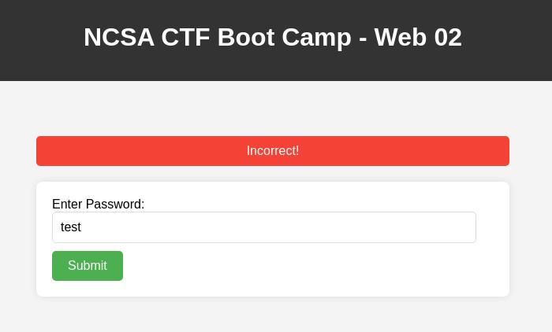
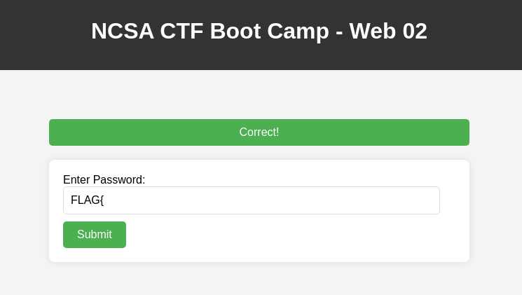
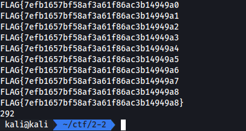
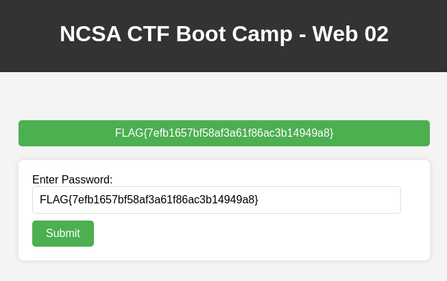

# Partial Flag Check Service

Tag: `web`

โจทย์ข้อนี้เราต้องเด่าว่า flag คืออะไร โดยที่มีคำใบ้ว่าเราสามารถที่จะเดาที่ละตัวแล้วตรวจสอบว่า flag นั้นถูกต้องไหม โดยที่ภายใน flag คือ md5

## Screen



เมื่อกรอกผิด



เมื่อเรากรอกถูกส่วนหนึ่ง

## Solving

จากการทดลองกรอก flag pattern เราพบว่า เป็นไปตามที่โจทย์อธิบาย

ความน่าจะเป็นของ md5 ที่ยาว 128 bits คือ $2^{128}$ ซึ่งเยอะมาก แต่โจทย์ได้ให้คำใบ้โดยการสามารถตรวจสอบได้ที่ละตัวอักษร เลยเหลือความน่าจะเป็นเพียง $16\cdot32$

เพื่อความรวดเร็วในการหาคำตอบที่ถูกต้องเราจึงเลือกที่จะเขียน script ในการ brute force

```py
import requests

URL = "https://websec.ctf.p7z.pw"

headers = {"Content-Type": "application/x-www-form-urlencoded"}
count = 0
flag = "FLAG{"
chars = "0123456789abcdef"

for _ in range(32):
    for c in chars:
        count += 1
        test = flag + c
        print(test)
        res = requests.post(URL, data={"password": test}, headers=headers).text
        if "Correct!" in res:
            flag = test
            break
        elif "Incorrect!" in res:
            continue
        else:
            flag = test
            break

print(flag + "}")
print(count)
```

## Result




