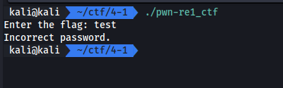
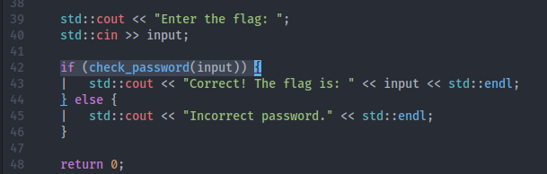
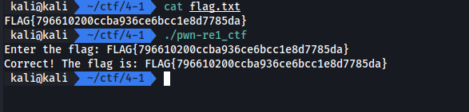

# Reverse w/ Code

ในโจทย์ข้อนี้เราได้ไฟล์มาสองไฟล์คือ ELF ไฟล์และ source code โดยเราต้องทำการใส่ flag เข้าไปแล้วโปรแกรมจะตอบกลับมาว่า flag นั้นถูกต้องไหม

[pwn-re1_ctf.zip](./files/pwn-re1_ctf.zip)

## Screen

## Solving

เนื่องจากเรามี source code เราจึงมุ่งเป้าไปหาคำตอบที่ source code

จะเห็นได้ว่า เงื่อนไขนี้ได้ทำการ check ว่าคำตอบถูกต้องไหม

เราจึงไปต่อที่ function ที่ถูกเรียก จาก code จะพบวิธีตรวจสอบ password โดยวิธีการที่ใช้ในการตรวจสอบสรุปได้ดังนี้

- ตัวอักษรต้องเท่ากับ 38 (เกิดจาก flag pattern **6** + md5 **32** = **38**)
- ต้องขึ้นต้นด้วย `FLAG{` และลงท้ายด้วย `}`
- ภายใน flag pattern ต้องเท่ากับ `correct_password` โดย input ต้องเป็น raw hex

เราจึงสรุปได้ว่า password คือ ค่าในตัวแปร `correct_password` เราจึงนำมารวมกับ flag pattern จึงได้ flag

## Result

