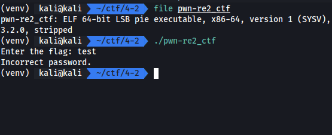
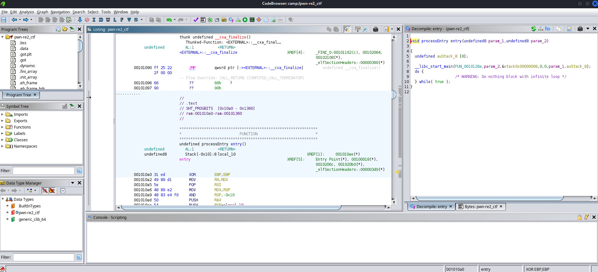
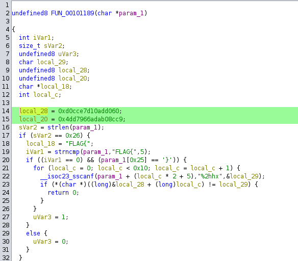
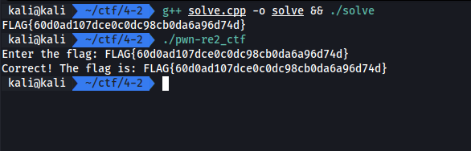

# Reverse w/o Code

Tag: `reverse`

โจทย์ข้อนี้ได้ไฟล์ ELF เพียงอย่างเดียว

[pwn-re2_ctf.zip](./files/pwn-re2_ctf.zip)

## Screen



## Solving



เนื่องจากไม่มี source code และ ELF ไฟล์นี้เป็นแบบ stripped เราจึงเริ่มจากการ reverse engineering เลย ซึ่งในครั้งนี้เราจะใช้ ghidra

เมื่อเปิดมาให้เรา analyze เลย

เราจะไล่เข้าไปหาจุดที่เปรียบเทียบคำตอบ

`__libc_start_main` -> `FUN_0010126e` -> `FUN_00101189`



จาก code ตัว loop แสดงให้เห็นว่า มันทำการตรวจสอบจาก input + 5 ถึง input + 5 + 32 ว่าตรงกับ `local_28` + `local_c` ไหม โดยก่อนเข้า loop จะทำการตรวจสอบ 5 ตัวแรกคือ `FLAG{` ตัวสุดท้ายคือ `}` ภายใน flag คือ hex 16 bytes หรือ char 32 ตัวนั้นเอง

โดยภายใน flag จะถูกเปรียบเทียบกับตัวแปร `local_28` ซึ่งจากการสังเกตุจะพบว่า `local_28` และ `local_20` นั้นมีขนาดเท่ากันและประกาศต่อกัน 8 + 8 = 16 bytes

เราจึงนำค่าในสองตัวแปรดังกล่าวมารวมกันเป็น character array ขนาด 16 bytes แล้วทำการแปลงกลับเป็น hex ที่ละ byte

```cpp
#include <iostream>
#include <iomanip>
#include <cstring>

using namespace std;

int main() {
    unsigned long long var1 = 0xd0cce7d10add060;
    unsigned long long var2 = 0x4dd7966adab08cc9;    
    size_t size = sizeof(var1) + sizeof(var2);

    unsigned char ptr[size];

    memcpy(ptr, &var1, sizeof(var1));
    memcpy(ptr + sizeof(var1), &var2, sizeof(var2));

    cout << "FLAG{";

    for (size_t i = 0; i < size; i++) {
        cout << hex << setw(2) << setfill('0') << (int)ptr[i];
    }

    cout << "}" << endl;

    return 0;
}
```

## Result


