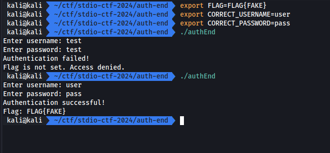
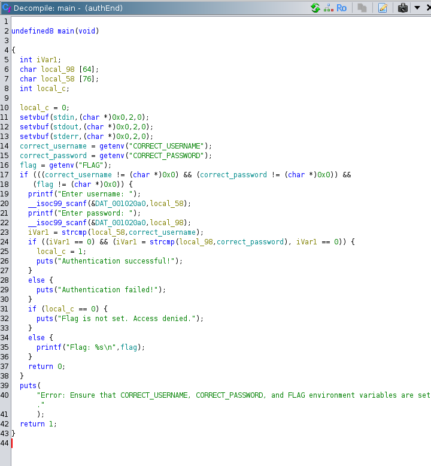
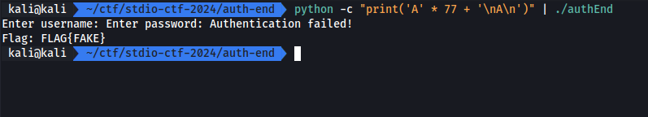
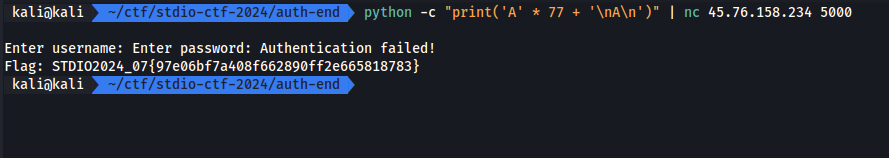

# Auth End

เราได้ไฟล์ ELF มาเพื่อหาวิธีเจาะช่องโหว่

[ch07_auth_end.zip](./files/ch07_auth_end.zip)

## Screen

## Solving

หลังจาก reverse แล้ว เงื่อนไขที่จะได้ flag คือ username และ password ต้องถูกต้อง

เมื่อเราสังเกตุจากตัวแปร buffer สำหรับรับค่า username ขนาด 76 และ password ขนาด 64 โดย stack จะเรียงจาก password(local_98) ต่อด้วย username(local_58) และ ตัวแปรที่เอาไว้เก็บเงื่อนไข (local_c)

จาก code จะสังเกตุได้ว่า `local_c` เป็นเงื่อนไขที่จำทำให้ code print flag ออกมาโดยเงื่อนไขคือ ห้ามเป็น 0 เราจึงมองหาวิธีทำให้ค่าไม่เป็น 0 ซึ่งจาก stack จะพบว่าเราสามารถ overflow ลงมาจาก `local_58` ได้

ปัญหาก่อน print flag คือค่า `local_c` จะเปลี่ยนเป็น 1 เมื่อ user/pass ถูก

เราจึงสรุปได้ว่าทำให้ user / pass ผิดและ user จะต้อง overflow ลงไปหา `local_c` ซึ่งก็คือ 76 + 1

## Result

