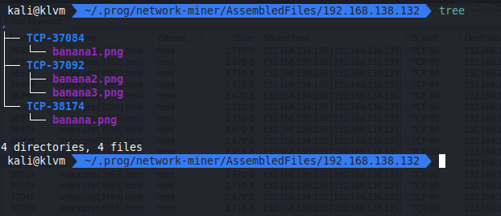

# Banana Network

| BananaNetwork was hacked by the famous hacker "GonnaCry" who found a vulnerability in the system by guessing the administrator's password. He was able to log in to the system and upload several encrypted files, one of which contained a secret flag. |
|:-|

เราต้องหาไฟล์ที่ถูกเข้ารหัส เพราะมันมี flag อยู่

[ch09_BananaNetwork.zip](./files/ch09_BananaNetwork.zip)

## Screen


## Solving

จากข้างต้นคือ เราจะต้องหาไฟล์ที่เข้ารหัสเพื่อที่จะทำการหาว่า flag อยู่ที่ไหน ซึ่งเราจะใช้ Network Miner สำหรับการ export ไฟล์

เนื่องจาก Network Miner ตัวฟรีใช้ pcapng ไม่ได้ เราเลยต้อง convert เป็น pcap ก่อน

```sh
tshark -F pcap -r [pcapng] -w [pcap]
```


หลังจากดูอยู่สักพักสิ่งที่เราพอสรุปได้คร่าวๆคือ

- มีการ login หลายครั้ง โดนการ brute force password
- มี SECRET อะไรสักอย่างอยู่ใน uploadgate.html
- banana.png ที่เป็น zip ถูก upload
- banana{1,2,3}.png เป็น plant text




แต่พบว่า banana.zip นั้นติด password


banana{1,2,3}.txt ก็เป็นอะไรแปลกๆ


พอลองนำ SECRET KEY ไป search ใน google แล้วพบว่ามี blog ที่ใช้ SECRET KEY นี้ [Hack The Box Writeup - Obscure](https://joshuanatan.medium.com/hack-bfc7c6528463)


เนื่องจากมี SECRET KEY ที่เหมือนกัน เราจึงตัดสินใจว่า มันน่าจะแก้คล้ายๆกัน เราเลยทำการอ่าน blog ดังกล่าวแล้วสรุปวิธีถอดคราวๆได้ว่า

`decode base64` -> `xor` -> `gzuncompress`


banana1.txt


banana2.txt


banana3.txt ตัว blog ได้ทำการ decode ด้วย base64 รอบที่สอง เราจึงทำตาม


ต่อมาเราจะทำการหา password ของ banana.zip โดยการทดลองกรองเอา password ใน brute force ที่เจอใน traffic ออกมา

```sh
tshark -r BananaNetwork.pcapng -Y 'http.request.method == "POST" && http.content_type == "application/x-www-form-urlencoded"' -T fields -e http.file_data > data-str-hex.txt
```

```py
from urllib.parse import unquote

data = open("data-str-hex.txt").read().split("\n")
data = [unquote(bytes.fromhex(line).decode("utf-8").replace("username=admin&password=", "")) for line in data]

open("passwords.txt", "w", encoding="utf-8").write("\n".join(data))
```

เมื่อเราได้ password list มาแล้วเราก็จะทำการลองมันทุกตัวเลย โดยเราจะใช้ john the ripper ในการหา

```sh
zip2john banana.zip > banana.hash
john banana.hash --wordlist=passwords.txt
```


flag.jpg เป็นเพียงรูปหลอก


เราทำการหาไฟล์ต่างๆด้วย `tree -a` แล้วพบกับ .goldenbanana เราเลย copy ออกมายัง workspace ของเรา

```sh
cp $(find . -name .goldenbanana) .
```

แล้วพบว่ามันคือ PGP private key block ซึ่งเราไม่รู้ password เราจึงทำการ crack

```sh
gpg2john Database.kdbx.gpg  > Database.kdbx.hash
john Database.kdbx.hash --wordlist=./passwords.txt
```


แล้วเราก็ทำการ import แล้วก็ decrypt ด้วย password ที่ได้มา

```sh
gpg --import key.pgp
gpg --output Database.kdbx --decrypt Database.kdbx.gpg
```

เสร็จแล้วเปิดด้วย keepass

## Result


