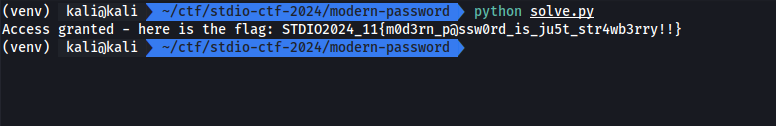

# Modern password

ได้ code สำหรับรับรูปไปทำอะไรสักอย่าง ถ้าผลรวมถูกจะได้ flag

```py
URL_PASSWORD = "https://upload.wikimedia.org/wikipedia/commons/thumb/0/05/Cat.png/307px-Cat.png"

import torch
import torchvision
from PIL import Image
import requests

class Decoder(torch.nn.Module):
    def __init__(self):
        super().__init__()
        self.training = False
        self.flag = torch.Tensor([
            0x2c, 0x2b, 0xff, 0x5e, 0xa0, 0xd4, 0x86, 0x98, 0x93,
            0x7a, 0x72, 0x16, 0xcc, 0x65, 0x76, 0x5e, 0x28, 0x4f,
            0x2e, 0x39, 0x78, 0xf6, 0x15, 0xda, 0x6e, 0x35, 0x6d,
            0xd6, 0x83, 0xdf, 0x2a, 0x67, 0xd5, 0x60, 0xeb, 0x9a
        ]).int()

    def forward(self, x):
        torch.manual_seed(x)
        x = torch.nn.Embedding(0o1750, 0o44, padding_idx=0)(x)
        x = torch.abs(255 * x).int() % 0xFF
        if x.sum() != 0o7617:
            return "Access denied - please provide correct password"
        return (
            "Access granted - here is the flag: "
            + f"STDIO2024_11{{{ ''.join([chr(c) for c in (x ^ self.flag).tolist()]) }}}"
        )

class ModernPassword(torch.nn.Module):
    def __init__(self):
        super().__init__()
        self.training = False
        self.backbone = torchvision.models.mobilenet_v2(weights=torchvision.models.MobileNet_V2_Weights.DEFAULT, progress=False)
        self.backbone.eval()
        self.decoder = Decoder()
        self.prep = torchvision.transforms.Compose([
            torchvision.transforms.Resize(256),
            torchvision.transforms.CenterCrop(224),
            torchvision.transforms.ToTensor(),
            torchvision.transforms.Normalize(mean=[0.485, 0.456, 0.406], std=[0.229, 0.224, 0.225]),
        ])

    def forward(self, url):
        try:
            img = Image.open(requests.get(url, stream=True, headers={'User-Agent': 'STDIO2024'}).raw)
            out = self.prep(img).unsqueeze(0)
            assert out.shape == (1,3,224,224)
        except:
            return "Access denied - error loading image from URL"
        return self.decoder(torch.argmax(self.backbone(out)))

model = ModernPassword()
print(model(URL_PASSWORD))
```

## Solving

จะสังเกตุได้ว่า class `ModernPassword` นั้นจะทำการ download รูปจาก url แล้วแปลงไปเรื่อยๆ แต่ก่อนเข้า `self.decoder` นั้นคือ `torch.argmax` ซึ่งถ้าเรา debug ด้วยการดักค่าตรงนั้นออกมาดูจะพบว่าเป็น scalar tensor

ไม่ว่าเราจะเอารูปไหนเข้าไป ค่าตรงนี้จะเป็น scalar เราจึงทำการ brute force

```py
i = 0
while (True)
    result = Decoder()(torch.tensor(i))
    if "flag" in result:
        print(result)
        break
    i += 1
```

## Result


