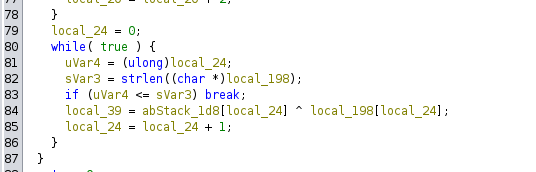
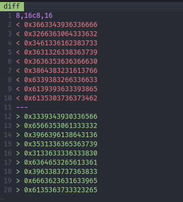
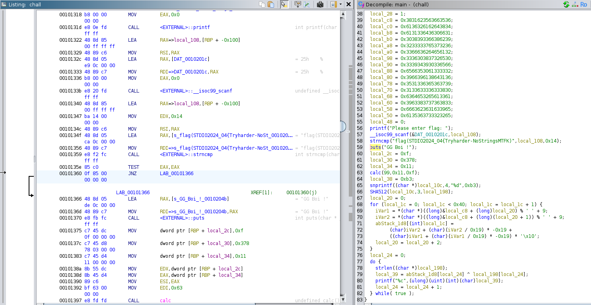
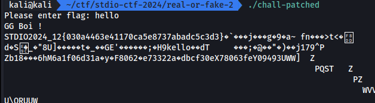

# Real or Fake 2

ต่อเนื่องจากข้อ [Real or Fake](./real-or-fake.md) ซึ่งข้อนี้ คำใบ้คือ "ครั้งนี้พลาดจริงๆ ตรงล่างสุด"

ครับ...

[ch04_real_or_fake.zip](./files/ch04_real_or_fake.zip)

## Solving

หลังจาก reverse แล้วเราจะเจอทันทีว่า มันไม่มี printf ตรง loop ที่ใช้ output

diff real or fake 1 และ 2 ต่างกันตรงที่ตัวแปรที่ 8 - 16

และอีกหนึ่งจุดคือ ค่าที่ประกาศไว้ในตอนแรกถูกแก้ไข นั้นหมายความว่า flag ไม่ใช่ตัวเดียวกันกับข้อแรกแน่ๆ

โดยรวมแล้วข้อ 2 มี flag ใหม่ และไม่มี printf แถมจะใส่ if 0 < 64 มาอีก เราจึงแก้ปัญหาด้วยการยืม ELF ที่ patch แล้วในข้อก่อนมาใช้ เพื่อใช้แทนที่ค่า flag ใหม่ ให้คำนวณออกมา

หลังจาก patch เพื่อความง่ายอีกครั้ง เราก็ข้าม check prefix input ไปทำให้ใส่อะไรก็ได้

## Result

