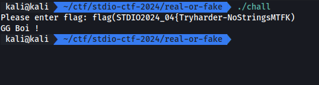

# Real or Fake

ได้ไฟล์สำหรับ reverse มา เป็น ELF

[ch04_real_or_fake.zip](./files/ch04_real_or_fake.zip)

## Screen



## Solving

### Ghidra decompile

```cpp
undefined8 main(void)

{
  int iVar1;
  int iVar2;
  size_t sVar3;
  ulong uVar4;
  byte abStack_1d8 [64];
  byte local_198 [140];
  uchar local_10c [4];
  char local_108 [64];
  undefined8 local_c8;
  undefined8 local_c0;
  undefined8 local_b8;
  undefined8 local_b0;
  undefined8 local_a8;
  undefined8 local_a0;
  undefined8 local_98;
  undefined8 local_90;
  undefined8 local_88;
  undefined8 local_80;
  undefined8 local_78;
  undefined8 local_70;
  undefined8 local_68;
  undefined8 local_60;
  undefined8 local_58;
  undefined8 local_50;
  undefined local_48;
  byte local_39;
  undefined4 local_38;
  undefined4 local_34;
  undefined4 local_30;
  undefined4 local_2c;
  undefined4 local_28;
  int local_24;
  int local_20;
  uint local_1c;

  local_28 = 1;
  local_c8 = 0x3831623563663536;
  local_c0 = 0x6136326162643834;
  local_b8 = 0x6131336436306631;
  local_b0 = 0x3038393366386239;
  local_a8 = 0x3233333765373236;
  local_a0 = 0x3366636264656132;
  local_98 = 0x3336303837326530;
  local_90 = 0x3663343936336666;
  local_88 = 0x3266363064333632;
  local_80 = 0x3461336162383733;
  local_78 = 0x3631326338363739;
  local_70 = 0x3636353636366630;
  local_68 = 0x3864383231613766;
  local_60 = 0x6339383266336633;
  local_58 = 0x6139393633393865;
  local_50 = 0x6135303736373462;
  local_48 = 0;
  printf("Please enter flag: ");
  __isoc99_scanf(&DAT_0010201c,local_108);
  iVar2 = strncmp("flag(STDIO2024_04{Tryharder-NoStringsMTFK)",local_108,0x14);
  if (iVar2 == 0) {
    puts("GG Boi !");
    local_2c = 0xf;
    local_30 = 0x378;
    local_34 = 0x11;
    calc(99,0x11,0xf);
    local_38 = 0xb3;
    snprintf((char *)local_10c,4,"%d",0xb3);
    SHA512(local_10c,3,local_198);
    local_20 = 0;
    for (local_1c = 0; local_1c < 0x40; local_1c = local_1c + 1) {
      iVar2 = *(char *)((long)&local_c8 + (long)local_20) % ' ' + 9;
      iVar1 = *(char *)((long)&local_c8 + (long)(local_20 + 1)) % ' ' + 9;
      abStack_1d8[(int)local_1c] =
           (char)iVar1 + (char)(iVar1 / 0x19) * -0x19 +
           ((char)iVar2 + (char)(iVar2 / 0x19) * -0x19) * '\x10';
      local_20 = local_20 + 2;
    }
    local_24 = 0;
    while( true ) {
      uVar4 = (ulong)local_24;
      sVar3 = strlen((char *)local_198);
      if (uVar4 <= sVar3) break;
      local_39 = abStack_1d8[local_24] ^ local_198[local_24];
      printf("Here\'s your flag: %c\n",(ulong)(uint)(int)(char)local_39);
      local_24 = local_24 + 1;
    }
  }
  return 0;
}
```

จากการสั่งเกตุคราวๆจะเห็นว่าตรง strncmp นั้นจะ check 20 ตัวแรก (0x14) แล้วทำการ hash sha512 จาก `local_10c` ไปเก็บที่ `local_198` แล้วทำการ loop สร้างค่าไปเก็บไว้ที่ `abStack_1d8` แล้วทำการ loop แสดงผล flag

แต่ทำไม flag ไม่ออก ? ถ้าเราอ่าน code จนละเอียดแล้วเราจะพบว่า input ของเราหลังจาก 20 ไม่ได้มีผลอะไรต่อเงื่อนไขของ output flag เลย เพราะเงื่อนไขที่ว่า ถ้า `local_24` น้อยกว่า ความยาวของ hash (64) ให้หยุด ซึ่งค่าเริ่มต้นของ `local_24` มันเริ่มจาก 0 เสมอ นั้นจึงเป็นสาเหตุให้ loop นี้หยุดทำงานทันที

และอีกเหตุผลหนึ่งคือ input ของเราไม่มีผลต่อการสร้าง output (flag) นอกจาก check ว่า 20 แรกตรงไหม


การแก้ปัญหา เราจะทำการลบ condition ตรงนี้ทิ้งด้วยการ jump


จะเห็นว่า output แต่ละ char นั้นจะเต็มไปด้วย string ที่เป็น prefix นี้ เราจึงลบมันออกเพื่อความง่ายในการเอา flag


patched

## Result


