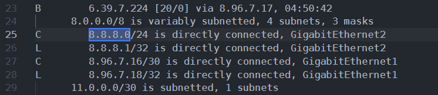
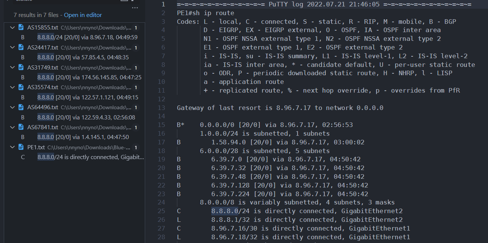
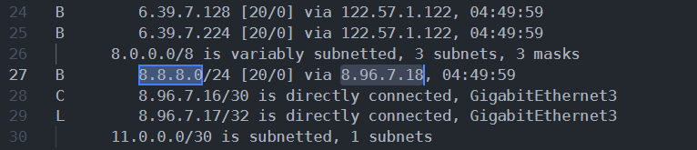
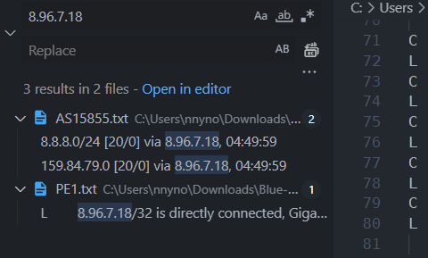

โดยสิ่งเราต้องหาก็คือ AS Number อะไรอยู่ใกล้ 8.8.8.8

ไฟล์อยู่ใน `/Blue Team 1/log/T1`

```
.
├── AS15855.txt
├── AS24417.txt
├── AS31749.txt
├── AS35574.txt
├── AS64496.txt
├── AS67841.txt
├── CE1.txt
└── PE1.txt
```

เปิดมันทุกไฟล์ด้วย [VSCode](https://code.visualstudio.com/)



ต้นทาง เราจะเริ่มจาก PE1

ค้นหา `8.8.8.8` แต่ไม่เจอ แต่ใช้ `8.8.8.0` ได้ แล้วก็พบกับ



เราจะพบว่ามี `8.8.8.0` อยู่ใน AS{number}.txt ทุกไฟล์



แต่มีไฟล์หนึ่งที่ via ip ถูกชี้ไปยัง ip ที่มีใน PE1 บรรทัด 28

และ ip ดังกล่าวยังมีปรากฎในเพียงแค่ 2 ไฟล์คือ `PE1.txt` และ `AS15855.txt`



คำตอบคือ `15855`
