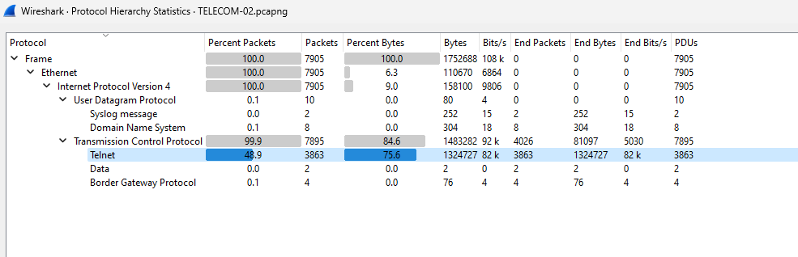

ถ้าต้องการดักข้อมูลต้องใช้ protocol:port อะไร

`/Blue Team 1/pcap/TELECOM-02.pcapng`

เปิดด้วย [Wireshark](https://www.wireshark.org) แล้วทำการ `Statistics > Protocol Hierarchy`

จะพบว่า packet ส่วนใหญ่เป็น Telnet บน TCP

และเมื่อเรา filter ด้วย telnet ก็จะพบการเชื่อต่อระหว่าง `39.39.39.39` และ `6.39.7.1`

และเมื่อสังเกตุเราจะพบว่า `6.39.7.1` นั้นเป็นฝั่ง server ที่เปิดผ่าน port `23`

ดังนั้น ถ้าเราต้องการทุกอย่างในการส่งข้อมูล จึงตองดักจาก protocol `tcp` port `23`

ตอบ `tcp:23`
