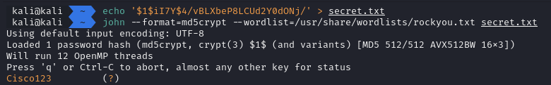

ให้เป็นตำสั่งสร้าง user ใน router cisco

โจทย์ถามว่า password คืออะไร

`username redaxe privilege 15 secret 5 $1$iI7Y$4/vBLXbeP8LCUd2Y0dONj/`

จากที่เห็นคือเป็นคำสั่งสร้าง user โดน secret เป็น type 5

ในข้อนี้เราจะทำการ brute force ตัว secret

แต่ก่อนที่เราจะไปทำ brute force เราจะใช้ wordlist ก่อน เพื่อเราหาเจอได้จาก wordlist มันจะช่วยให้ประหยัดเวลา

ในที่นี้เราจะใช้ kali linux เราจะได้ wordlist มาจาก

```sh
sudo apt install wordlists
```

เสร็จแล้วทำการไป extract gz

```sh
cd usr/share/wordlists
sudo gunzip /usr/share/wordlists/rockyou.txt.gz
```

```sh
echo '$1$iI7Y$4/vBLXbeP8LCUd2Y0dONj/' > secret.txt
john --format=md5crypt --wordlist=/usr/share/wordlists/rockyou.txt secret.txt
```



ตอบ `Cisco123`
