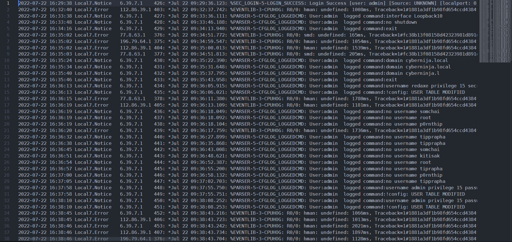
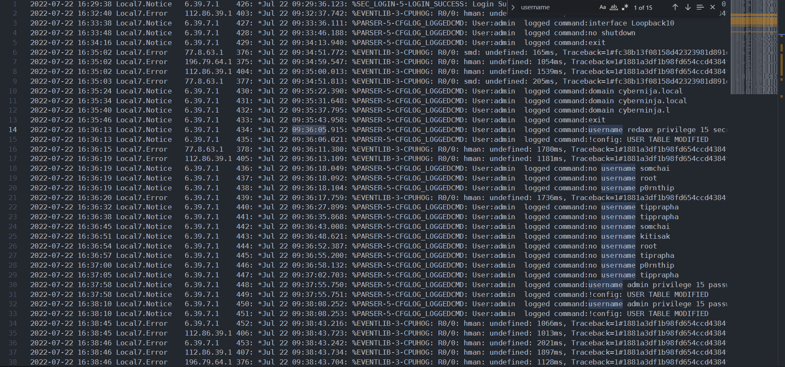

:ในข้อนี้ โจทย์ถามว่า ผู้โจมตีทำการสร้าง user ใหม่ครั้งแรกเวลาไหน รูปแบบคำตอบ utc (hh:mm:ss)

ในข้อนี้เราจะมองหาไฟล์ log

`/Blue Team 1/log/T6-8/syslog.txt`

ไฟล์ดังกล่าวเป็นไฟล์จาก syslog

เราจะมองหาคำสั่งที่เป็นคำสั่งสร้าง user คือคำสั่ง `username`

มีการเก็บ log จาก `6.39.7.1` เขียนใน syslog เวลา `2022-07-22 16:36:13` โดยเวลาที่เกิดขึ้นคือ `Jul 22 09:36:05.915`

ตอบ `09:36:05`
