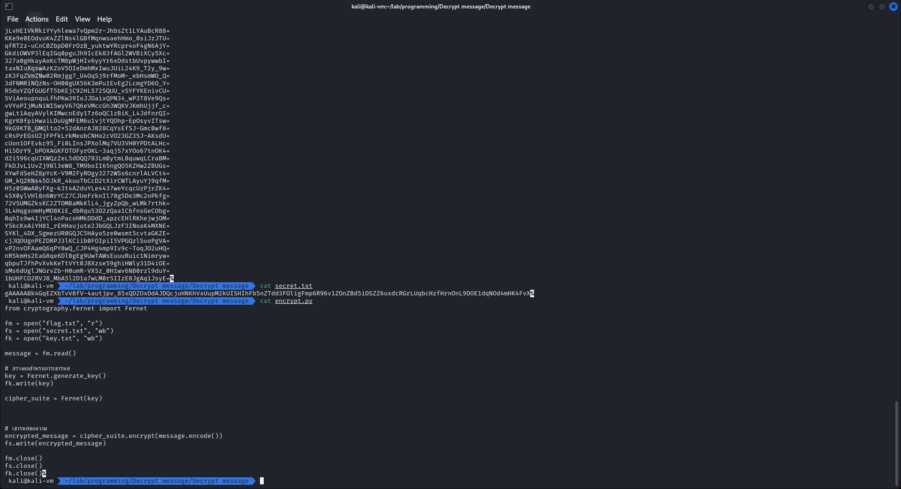

# Decrypt message

```
.
└── Decrypt message
    ├── encrypt.py
    ├── key.txt
    └── secret.txt
```

---

เราได้ file มา 3 ไฟล์ จากการอ่านไฟล์เราก็ทราบว่า

- `encrypt.py` ใช้เข้ารหัส
- `key.txt` ใช้เก็บ key
- `secret.txt` ใช้เก็บข้อความที่ถูกเข้ารหัส



แต่ความแปลกคือ key.txt ดูเหมือนจะไม่ได้มี key เดียวนะสิ

ดังนั้นเราจึงสรุปสิ่งที่เราจะทำออกมาได้ 2 อย่างคือ

- เขียน decrypt.py
- หา key ที่ถูกต้อง

```py
from cryptography.fernet import Fernet

fm = open("flag.txt", "w")
fs = open("secret.txt", "rb")
fk = open("key.txt", "r")

secret = fs.read()

for key in fk.read().split("\n"):
    try:
        cipher_suite = Fernet(key.encode())
        decrypted_message = cipher_suite.decrypt(secret)
        break
    except:
        pass

fm.write(decrypted_message.decode())

fm.close()
fs.close()
fk.close()
```

```sh
python3 decrypt.py
```

แล้ว flag จะอยู้ในไฟล์ `flag.txt`


