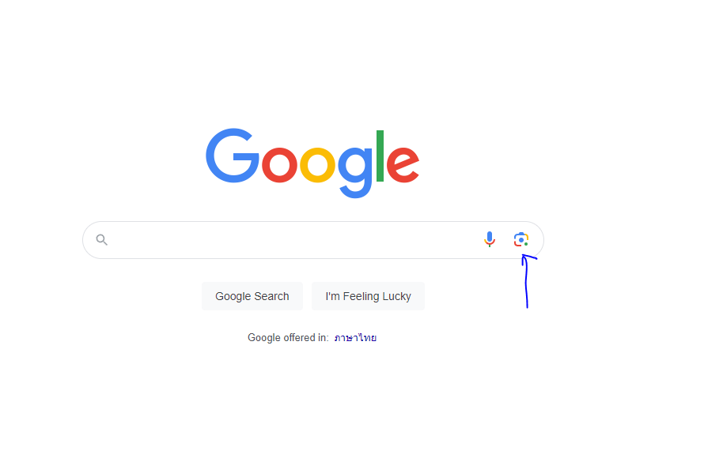
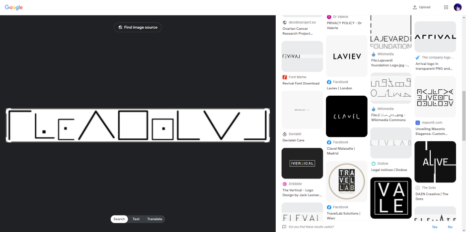
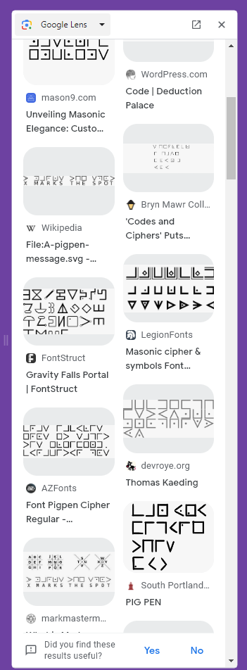
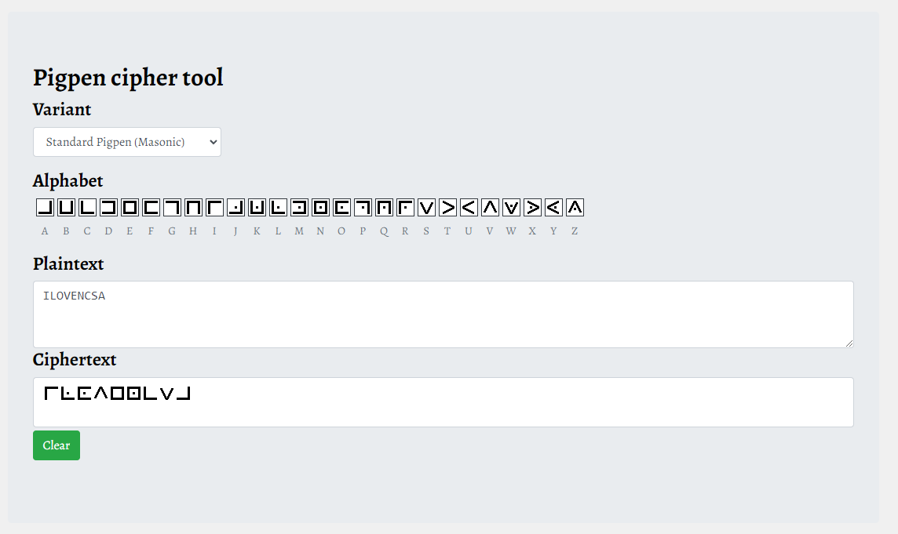

# Lineman

```
.
└── Lineman.png
```

**Flag found by: [@c0ffeeOverdose](https://github.com/c0ffeeOverdose)**

เราได้รูปๆหนึ่งมา ไม่รู้ว่ามันคืออะไร แต่รู้สึกคุ้นๆ เหมือนเคยเห็นที่ไหนมาก่อน


ลอง `Google len`




เลื่อนๆ ไป เหมือนจะเจอรูปที่คล้ายๆ กัน



ลองกด `Search image with Google`


พอเลื่อนๆ ไป เราก็จะเจอคำประมาณ `pigpen`, `Pigpen Cipher`



Hm มันคืออะไร! พอเราลองไป Search ดู


เหมือนจะมาถูกทาง งั้นลอง Search `pigpen cipher online decoder` เราก็จะเจอเว็บ สำหรับ decode แล้วเราลอง กดตามภาพที่ได้



นี้มันใช่ ใช่แน่ๆ แต่ Flags จะอยู่ในรูป `CTT23{Flags}` เพราะงั้น Flags ก็จะเป็น `CTT23{ILOVENCSA}` ง่ายใช่ไหมละ 😏😏😏
