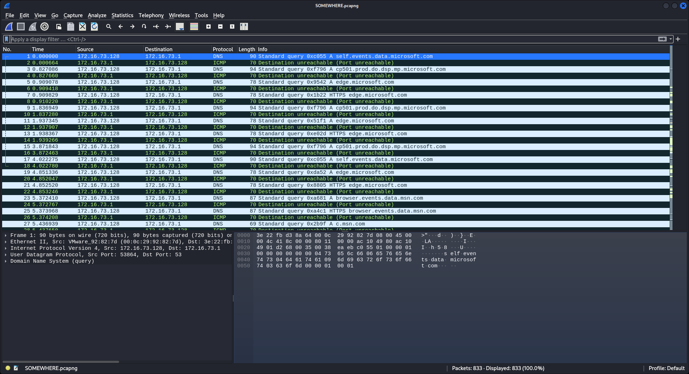
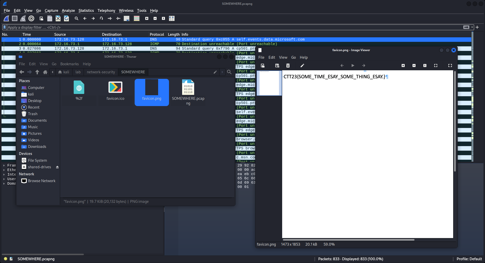

# SOMEWHERE

```
.
└── SOMEWHERE.pcapng
```

---

ไฟล์ที่เราได้มาคือไฟล์ pcapng เป็นไฟล์ packet capture สามารถเปิดได้โดยใช้ [Wireshark](https://www.wireshark.org)



จากที่เราเห็น จะเป็น packet ปะปนกันไปหมด พอถึงจุดนี้ไม่รู้ทำไม เลยลองไป export HTTP ออกมาดู

- `File > Export Objects > HTTP`


แน่นอน เราไม่รอช้าที่จะ save มันออกมาดู และเราก็ได้พบกับ flag ที่อยู่ใน `favicon.png`


