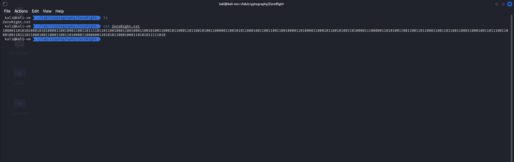

# ZeroRight

```
.
└── ZeroRight.txt
```

---

เราได้มาเป็น file txt ตัวหนึ่งด้านในเป็น string ที่มีแค่ 0 และ 1



เราเดาว่ามันต้องเป็น text ที่ถูกเข้ารหัสมาเป็น binary แน่ๆ

แต่ปัญหาคือโดนเข้ารหัสอะไรมาบ้างละ ?

ด้วยความขี้เกียจเราจึงจับโยนเข้า CyberChef แล้วใช้เวทมนต์ในการถอดรหัส (แนะนำให้ใช้ Google Chrome)

- Magic with Intensive mode and Depth default (3)

จากนั้นทำการค้นหาทั้งหน้าเว็บด้วยด้วย flag pattern ของงานนี้ `CTT23`


