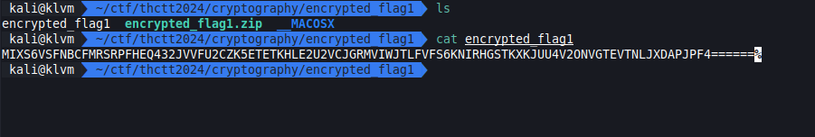
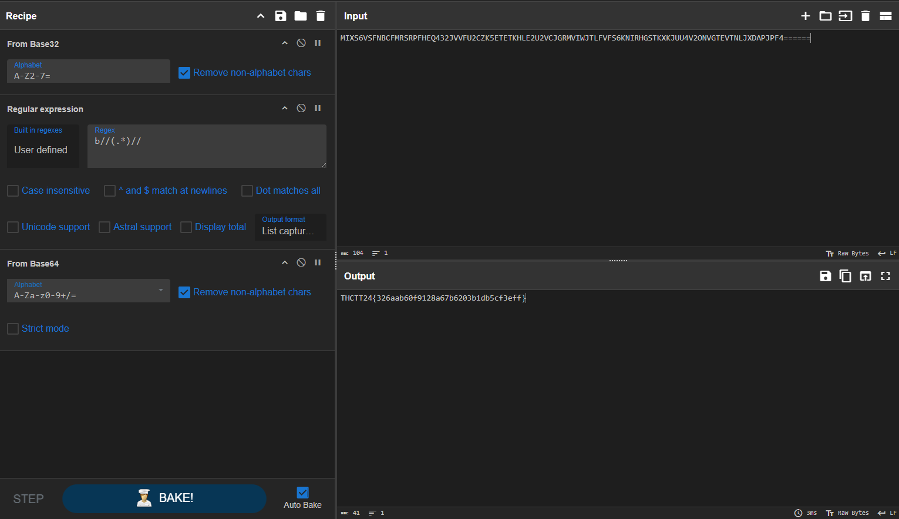

# Easy 1

[encrypted_flag1.zip](../../files/encrypted_flag1.zip)

## Solving

ใช้ Cyber Chef ในการถอดรหัส

| Recipe | Setting | Description |
| :-- | :-: | :-- |
| From Base32 | | |
| Regular expression | `b//(.*)//` Output capture group | ลบส่วนที่ไม่ต้องการ |
| From Base64 | | |

## Result

