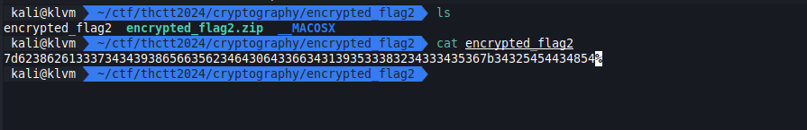
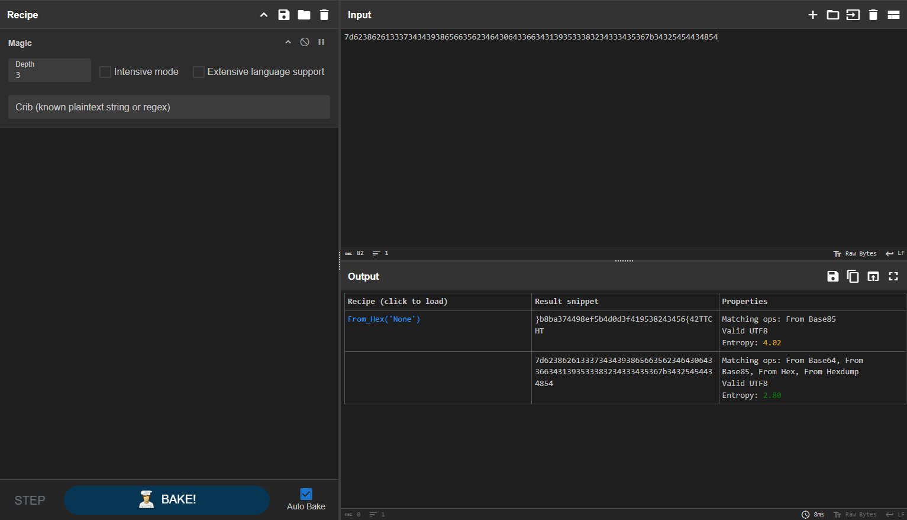
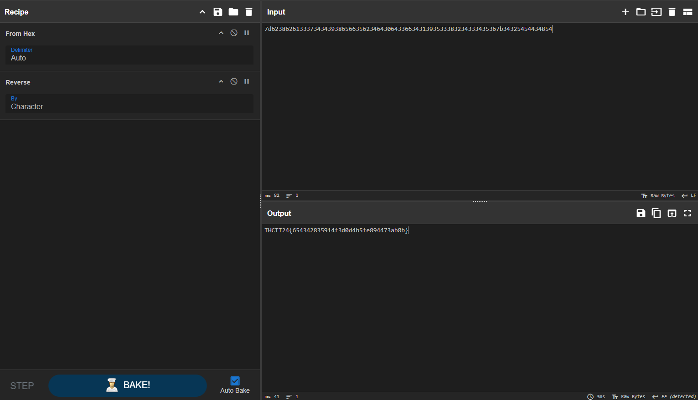

# Easy 2

[encrypted_flag2.zip](../../files/encrypted_flag2.zip)

## Solving

เริ่มจาก Cyber Chef เหมือนเดิม ด้วย `Magic` แล้วเราก็เจอเลย ที่เหลือก็ Reverse

| Recipe |
| :-- |
| From_Hex |
| Reverse |

## Result

