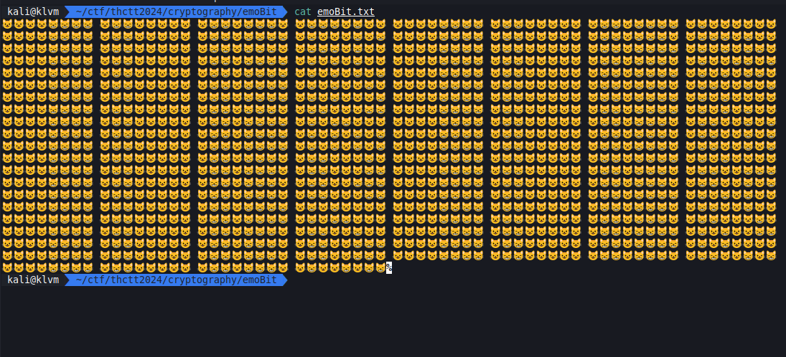
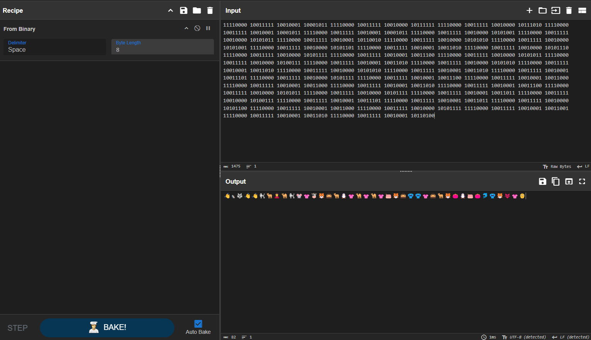
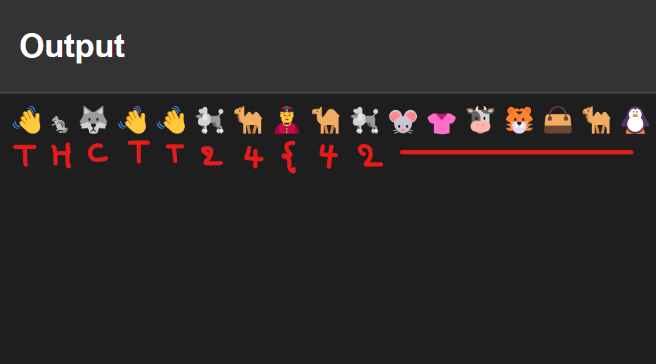
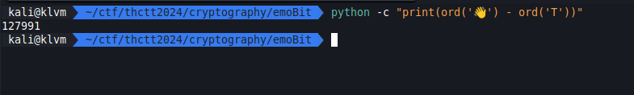
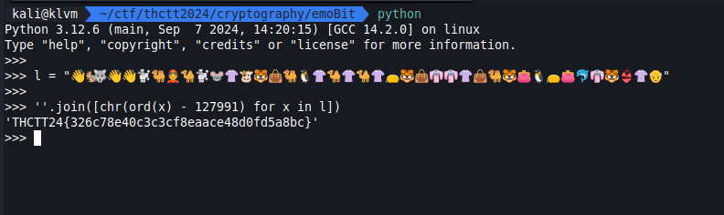

# Hard



[emoBit.zip](../../files/emoBit.zip)

## Solving

เริ่มจากการนั่งจ้องก่อนเลย ถ้าเราลองไล่ดูว่ามี emoji อะไรบ้างละ นับจำนวนต่อการเว้นวรรจะพบว่ามันคล้ายๆ byte ซึ่งจำนวน byte จะเท่ากับ 164 bytes

เราจึงทำการแปลงมัน แล้วไปต่อที่ Cyber Chef

```sh
cat emoBit.txt | python -c "print(''.join([x.replace('😺', '1').replace('😸', '0') for x in input()]), end='')" > bytes.txt
```



ด้วย `From Binary` output แสดงให้เราเห็นว่า เรามาถูกทางสินะ ออกมาเป็น emoji สวยงามแบบนี้ ว่าแต่มันไปต่อยังไง ? นั่งจ้องอีกสิ

> กรณีที่เรา replace emoji ด้วย 0, 1 สลับกันมันจะทำให้เราได้อะไรที่อ่านไม่ได้ ซึ่งเราแก้ปัญหาด้วยการใช้ recipe `NOT` หลัง `From Binary` ได้



เราพบว่า emoji พวกนี้มี pattern เหมือนกันกับ flag pattern ของงานนี้ เราจึงคิดว่ามันน่าจะเป็น offset ตัว char แหละที่เลื่อนไปจาก range alphabet จนไปหา range ที่เป็น emoji เราจึงหาว่ามัน offset เท่าไหร่ด้วยการเอาตัวแรกมาลบกัน



พบว่า offset ของมันคือ 127991 เสร็จแล้วเราก็นำ emoji พวกนี้ไปลบกับค่า offset

## Result


