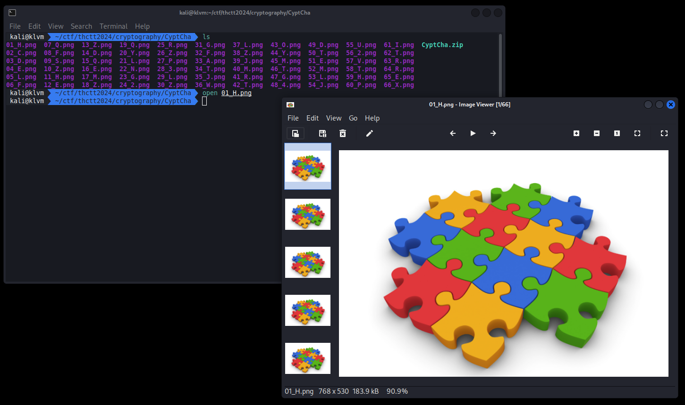
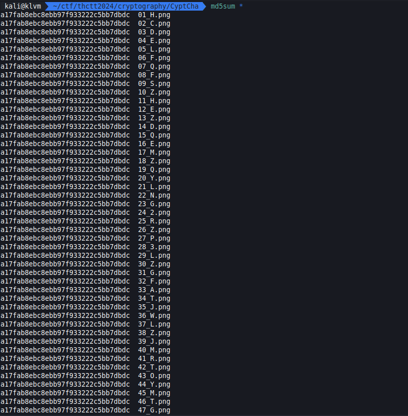
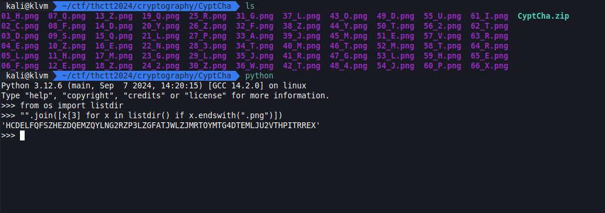
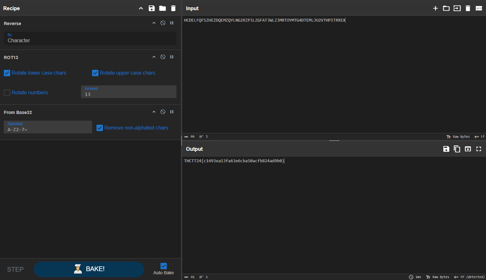

# Medium

[emoBit.zip](../../files/emoBit.zip)

## Solving

เริ่มจากหาว่ามันมีหลายไฟล์มันมีอะไรแปลกๆไหม แล้วเราพบว่าเป็นไฟล์เดียวกันหมดเลย ต่างกันแค่ชื่อ

แล้วต่างกันแค่ตรงชื่อ ? แต่ดันมีลำกับเป็นชื่อไฟล์ และตามด้วย char หนึ่งตัว เราจึงลองกรองเอา char พวกนั้นมาต่อกันดู

ต่อด้วย Cyber Chef

| Recipe |
| :-- |
| Reverse |
| ROT13 |
| From Base32 |

## Result

