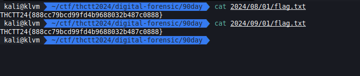
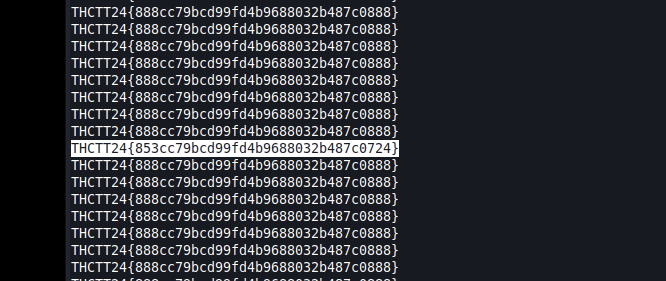

# Easy 1

```text
.
├── 2024
│   ├── 08
│   │   ├── 01
│   │   │   └── flag.txt
│   │   .
│   │   .
│   │   └── 31
│   │       └── flag.txt
│   ├── 09
│   │   ├── 01
│   │   │   └── flag.txt
│   │   .
│   │   .
│   │   └── 30
│   │       └── flag.txt
│   └── 10
│       ├── 01
│       │   └── flag.txt
│       .
│       .
│       └── 31
│           └── flag.txt
├── 90DAY.zip
└── Thailand_Cyber_Top_Talent_2024.jpg
```

[90DAY.zip](../../files/90DAY.zip)

## Solving

เปิดมาพบ flag.txt เยอะมาก เหมือนกันหลายไฟล์ด้วย แถมรูปที่ได้มาก็ไม่มีอะไรอีก



ไหนลองเปิดออกมาดูทุกอันหน่อยสิ

```sh
find . -type f -exec cat {} +
```

## Result


