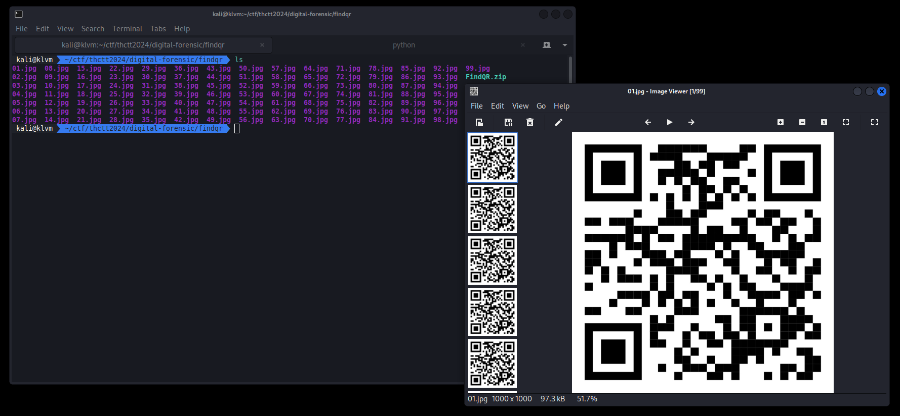
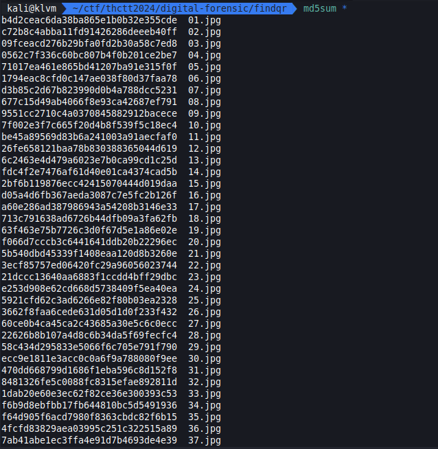
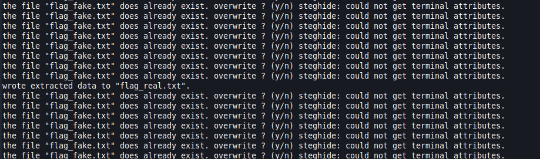
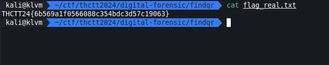

# Easy 2



[FindQR.zip](../../files/FindQR.zip)

## Solving

เราได้ไฟล์ QR Code มาเยอะมาก ซึ่งเราจะเริ่มจากการ checksum



พบว่ามันไม่เหมือนกัน แต่ด้านในจะมี text ที่ว่า `THCTT24` เราก็พยายามใช้ tool ต่างๆในการหาจนไปจบที่ steghide ที่ pass คือ text ที่ได้จาก QR Code ซึ่งเมื่อเราถอดออกมาได้คือไฟล์ flag แต่มันปลอม !

งั้นเพื่อความรวดเร็วเราจะรูดมันเลยละกัน

```sh
for file in *.jpg; do yes | steghide --extract -sf "$file" -p "THCTT24"; done
```



เจอไฟล์ flag

## Result


