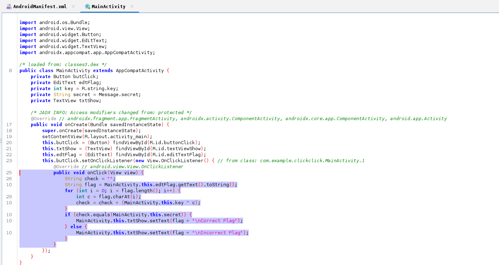
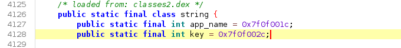
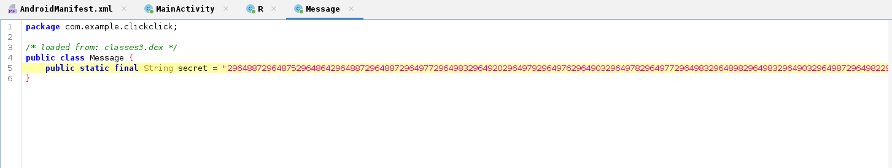
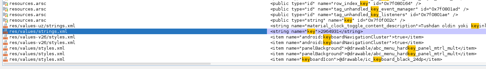
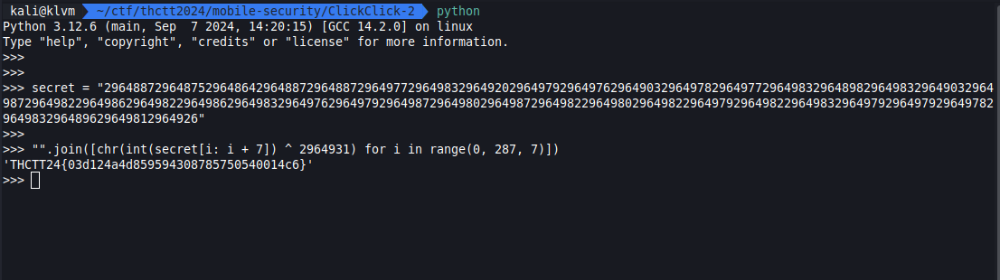

# Click Click

[ClickClick-2.zip](../../files/ClickClick-2.zip)

## Solving

เราเริ่มจากการ decompile แล้วไปที่ MainActivity



เราจะพบกับ code ที่ใช้ check flag ซึ่งจากข้างต้นจะสรุปได้ว่า

- รับค่าจากผู้ใช้
- loop XOR char กับ key ที่ละตัว
- ถ้า string ที่ได้เท่ากับ secret จะถือว่าถูก

เราเลยต้องหาว่า secret และ key คืออะไร

เริ่มจาก `key` ได้จาก `com.example.clickclick.R` (หลอก)



ต่อด้วย `secret` ได้จาก `com.example.clickclick.Message`



เรารู้ว่า flag จริงต้องมีขนาดเป็น 9 `THCTT24{}` + 32 `md5` = 41 และ secret ที่มี length เป็น 287 ซึ่งเมื่อหารกับ 41 แล้วจะได้ 7 นั้นหมายความว่าทุกๆ 7 char ของ secret นี้คือ char

แต่เดี๋ยวก่อนนะ เราได้ key มาตอนแรกแล้วนิ, ใช่ แต่ขนาดของมันนั้นใน string decimal มันใหญ่กว่า 7 หลัก ซึ่งคือ 10 หลัก

แล้วทำไงต่อ ? ก็หา key ใหม่ไง...

ว่าด้วยเรื่องการหา key เราสามารถหาได้สองวิธีคือ 1.หาใน app นั้นแหละ / 2.สร้างเอง

### สร้างเอง

เรารู้คุณสมบัติของ XOR ดีว่า `a^b = c` และ `b^c = a` และ `c^a = b` และเรารู้ว่า flag pattern เริ่มต้นลงท้ายคืออะไรเราจึงสามารถเรา key ได้

ยกตัวอย่าง เราเอา secret มาแยกออกทีละ 7 ตัว

```text
DEC 2964887  2964875  2964864  2964887  2964887  2964977
HEX 0x2d3d97 0x2d3d8b 0x2d3d80 0x2d3d97 0x2d3d97 0x2d3df1
    T        H        C        T        T        2
```

จะเห็นได้ว่าตรงตัว `T` นั้นจะมีค่าที่เหมือนกันเลย ดังนั้น key จะได้จาก `2964887` (0:8 secret) ^ `84` (T) ซึ่งก็คือ `2964931` นั้นเอง

### หาจากใน app



search เลยสิ แล้วดันเจอจริง

ที่เหลือก็ทำเอา key ที่ได้ไป XOR กับ secret 41 ตัว

## Result


