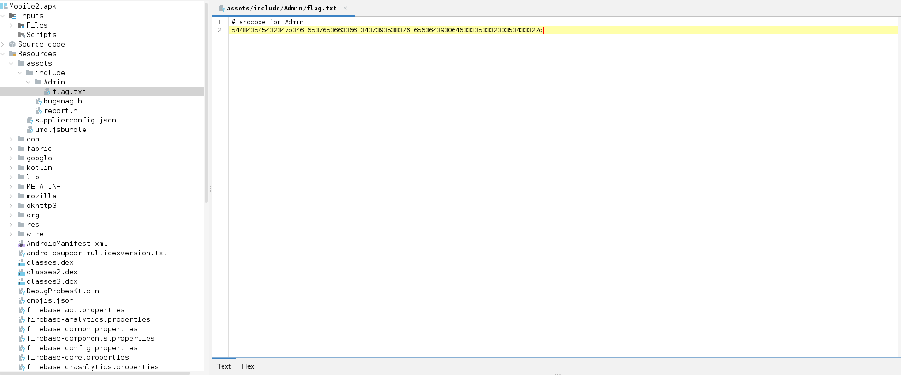
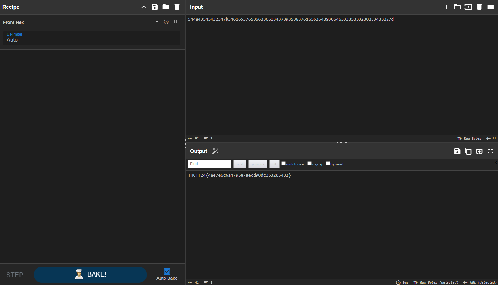

# Medium

[Mobile2.zip](../../files/Mobile2.zip)

## Solving



สำหรับข้อนี้จะพบ flag ได้ที่ assets ของ apk

เอาไปแปลงใน Cyber Chef ด้วย `From Hex`

## Result



### Cheat

```sh
binwalk -e Mobile2.apk && cat $(find . -name flag.txt) | xxd -r -p
```
