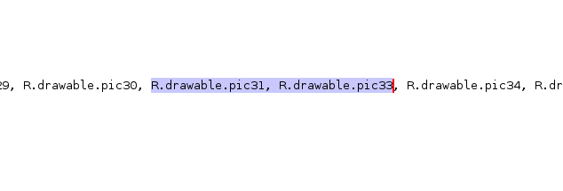
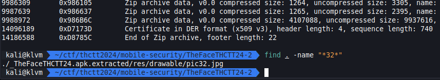
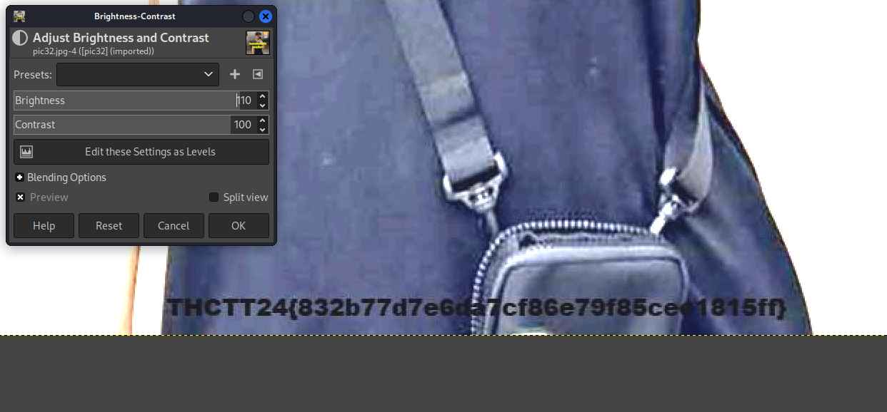

# The Face THCTT24

คำใบ้คือ ใครหายไป

[Mobile.zip](../../files/Mobile.zip)

## Solving

`com.example.thefacethctt24.MainActivity`



เราเริ่มจากจุดที่ใช้ random ค่าเพื่อเลือกรูปไปแสดง แล้วเราพบว่า 32 หายไปจาก array

แล้วรูปที่ 32 อยู่ที่ไหน ?

เพื่อความมักง่ายเราจะใช้ binwalk แล้ว search ชื่อไฟล์

```sh
binwalk -e TheFaceTHCTT24.apk
find . -name "*32*"
```




โดนเกรียนจริง

## Result

GIMP


