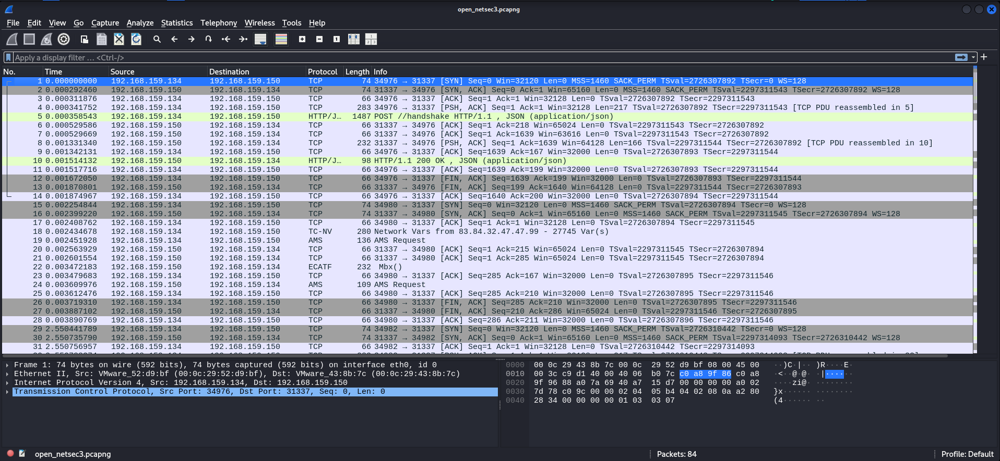
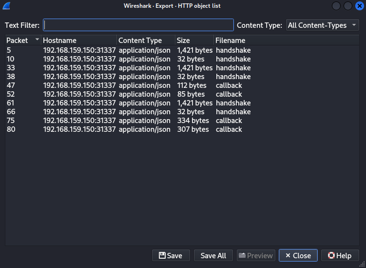
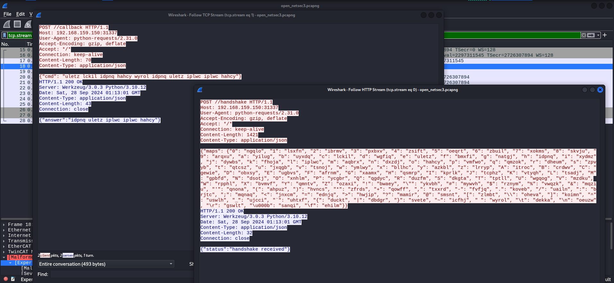
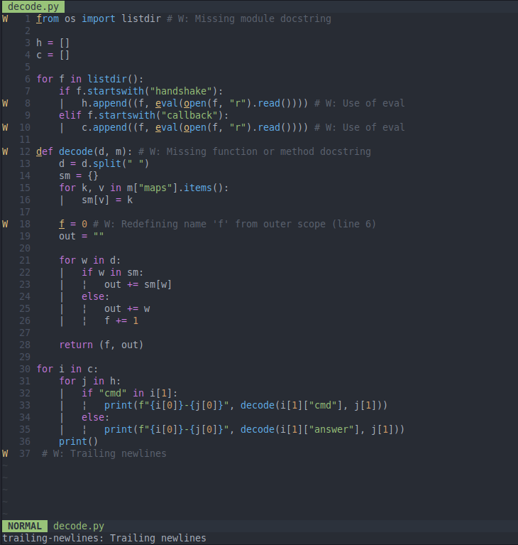
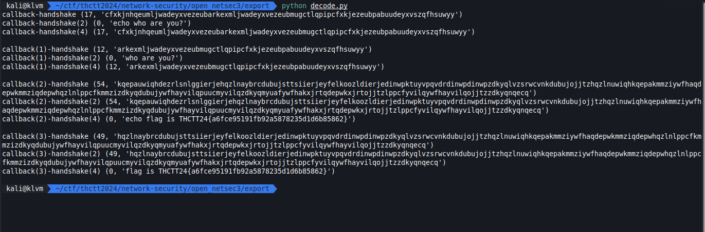

# Encrypted C2 v2

[open_netsec3.pcapng](../../files/open_netsec3.pcapng)

## Solving

export ไว้รอเลย

จากที่ดูคือเราต้องเอา maps ไปใช้ในการถอดรหัส จะได้จาก handshake และ ข้อความจะเกิดขึ้นตอน callback

เราเลยเขียน code loop ถอดมันทุกแบบไปเลย

## Result

it work
