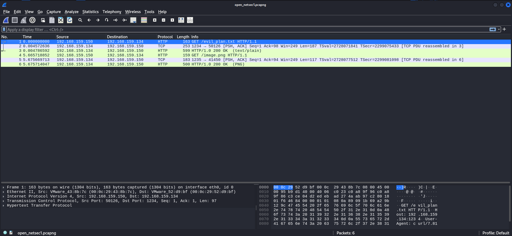
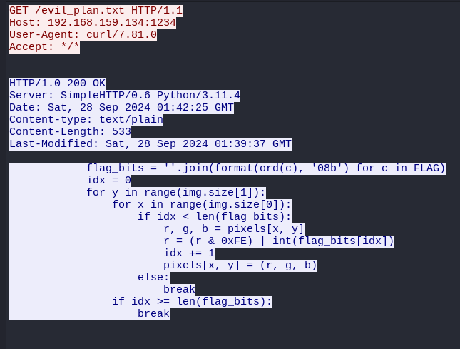
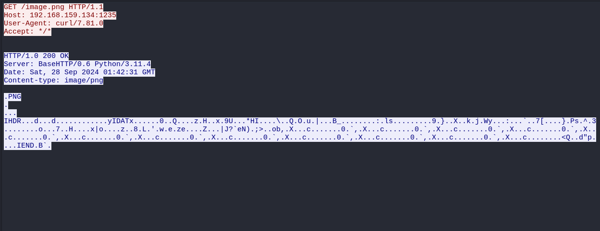
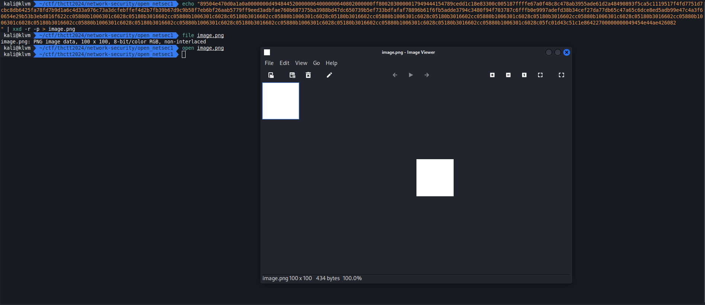
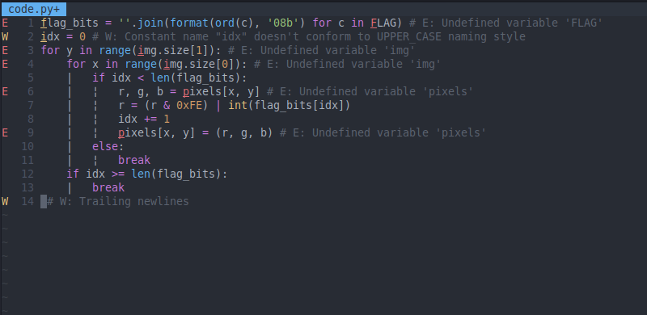
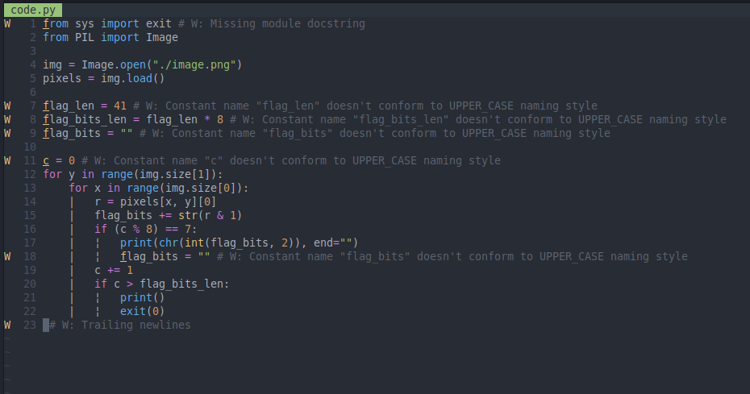
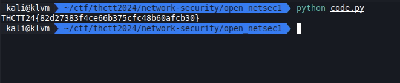

# HTTP Mayhem

[open_netsec1.pcapng](../../files/open_netsec1.pcapng)

## Solving

เราเปิดมาพบ 2 stream ที่เป็น http

มันคือ code python ที่เอาไว้ใช้ทำอะไรสักอย่าง

รูป

เราจึงลองเอารูปนั้นมาเปิดดู แต่ทำไมไม่มีอะไรเลย ?

เราจึงกลับไปดูที่ code เราจึงเดาๆได้ว่า code นี้ใช้ในการซ่อนข้อมูลใน pixle bit สุดท้าย

เราจึงเขียนแก้ code ให้ใช้เป็นการถอดรหัส

## Result

