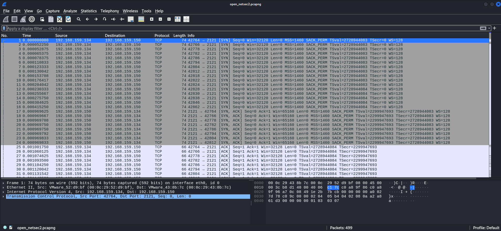
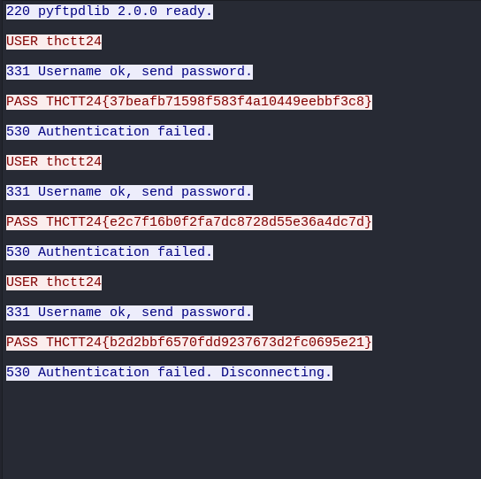
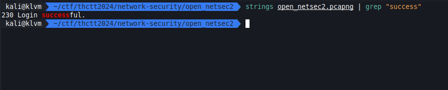
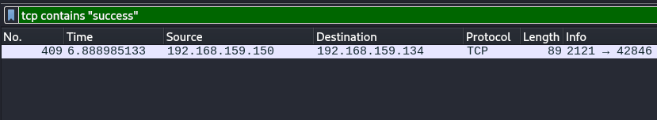

# Silent Whisper

[open_netsec2.pcapng](../../files/open_netsec2.pcapng)

## Solving

หน้าที่ของเราคือต้องมาหาว่า password ไหนที่ใช้เข้าสู่ระบบได้สำเร็จ

เราจึงทดลองด้วย key word สักตัวเพื่อดูว่ามันจะมีคำไหนบ้าง ซึ่งดูเหมือนถ้า login สำเร็จจะมีคำนี้

เราจึงเอาคำนั้นไป filter ใน wireshark

## Result

