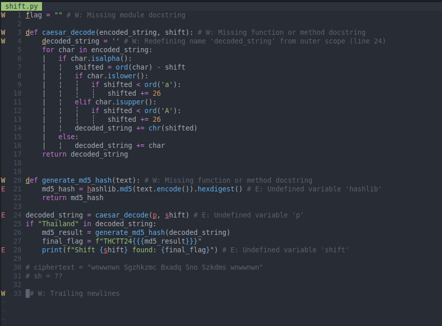
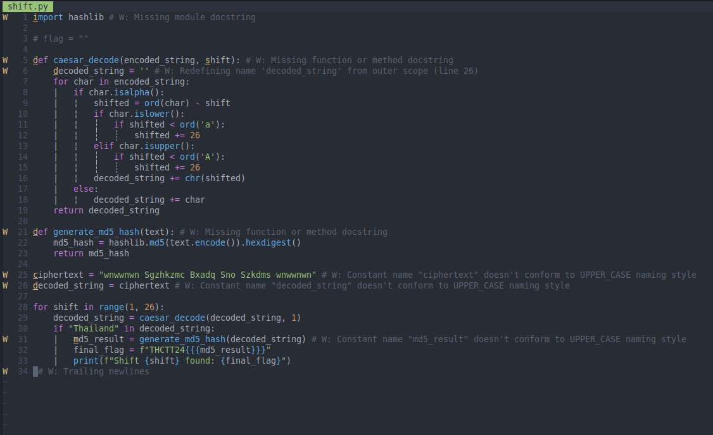
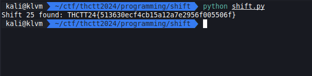

# Easy 1

[shift.zip](../../files/shift.zip)

## Solving

เราเห็นชื่อ function `caesar_decode` เราก็รู้ได้ทันทีเลยว่านี้คือ Caesar cipher

สิ่งที่เราต้องทำคือหาว่าต้องเลื่อน cipher ที่ได้มาจนเจอคำว่า `Thailand` และต้องแก้ code ที่ผิดด้วย

ซึ่งการเลื่อนแบบ basic นั้นไม่ยากจนเกินไป เราสามารถ loop เลื่อน check ไปทีละรอบจนเจอได้

## Result

