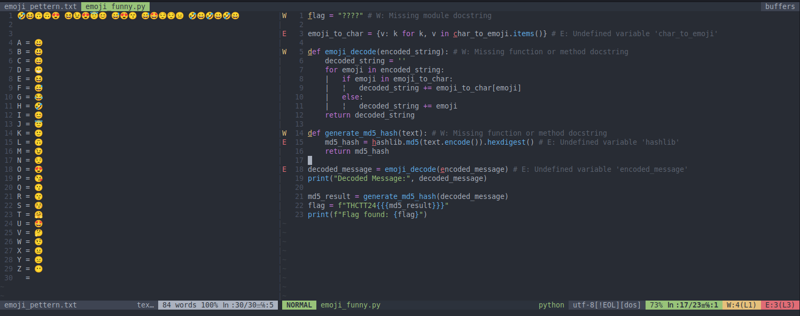
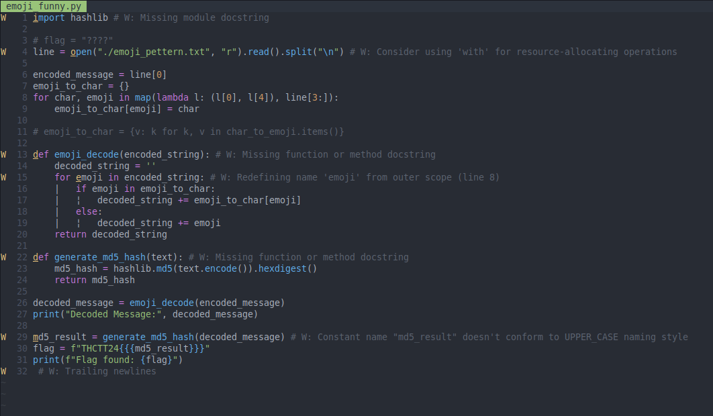
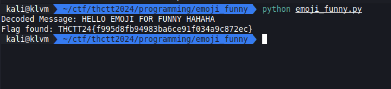

# Easy 2

[emoji_funny.zip](../../files/emoji_funny.zip)

## Solving

เปิดมาก็รู้ได้เลยว่านี้คือ Substitution cipher

ซึ่งจากข้างต้นเราแค่ต้องสร้าง map ที่ใช้ decode และแก้ code ที่ผิด

## Result

