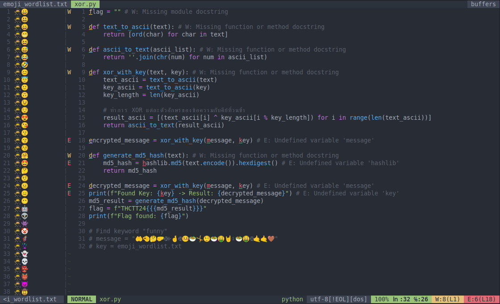
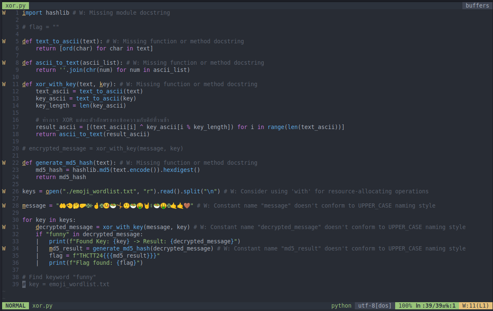
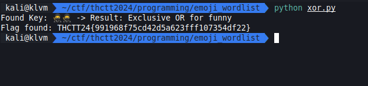

# Medium

[emoji_wordlist.zip](../../files/emoji_wordlist.zip)

## Solving

คำใบ้ที่ได้มาคือ key ต้องมีคำว่า `funny` หลัง decode

สิ่งที่เราต้องทำคือ loop ลอง key ไปเรื่อยๆจนเจอ และแก้ code ที่ผิด

## Result

