# Embedded Malware

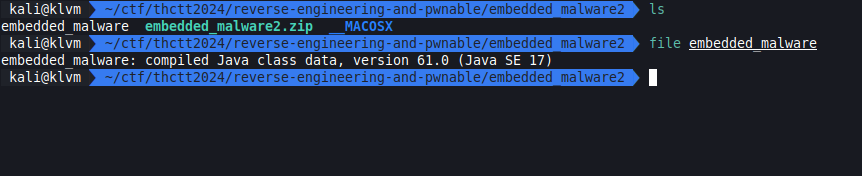

[embedded_malware2.zip](../../files/embedded_malware2.zip)

## Solving

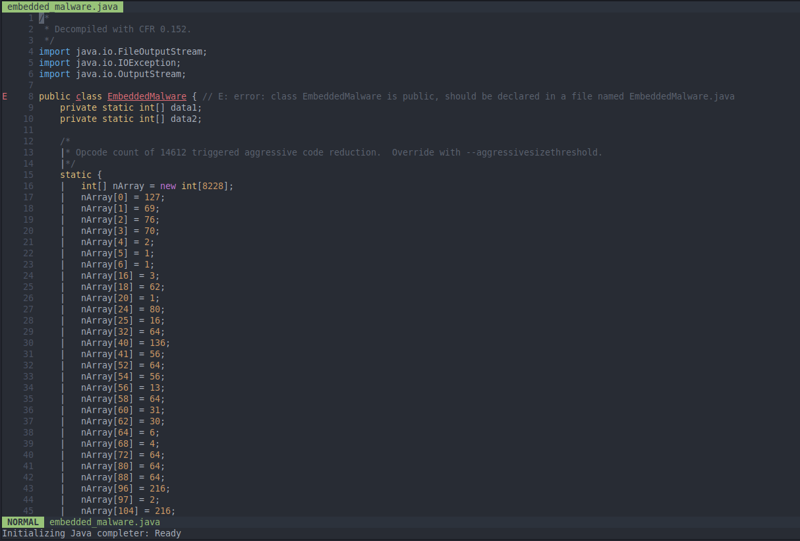

เริ่มจากใช้ cfr decompile แล้วพบว่า public class ไม่ตรงกับชื่อไฟล์

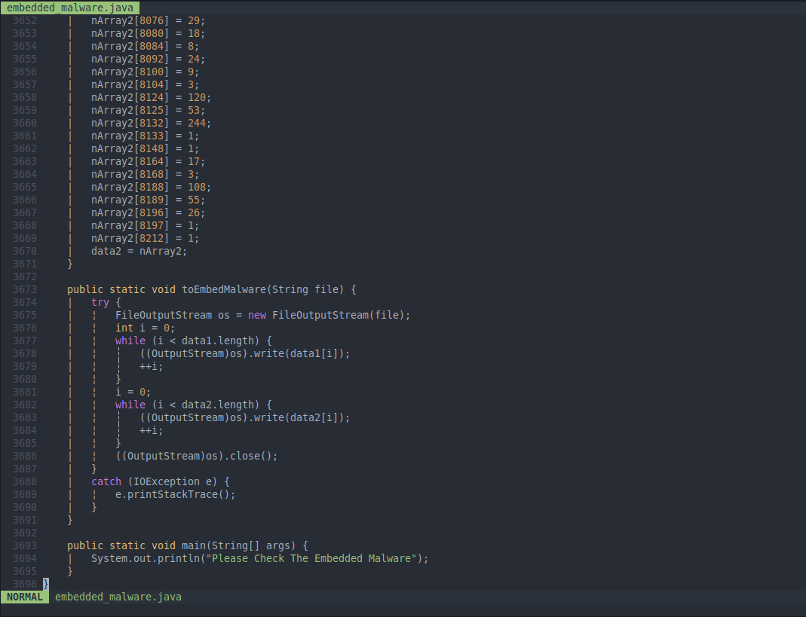

เจอ array สองตัว ยาวมาก พร้อมกับ function ที่ไม่ได้ใช้ถูกเรียก ซึ่ง function นั้นเอาไว้เขียนไฟล์จากข้อมูล array 2 ตัว

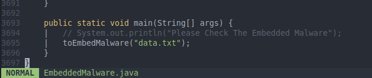

เราเปลี่ยนชื่อไฟล์และลองเรียก function นั้นดู

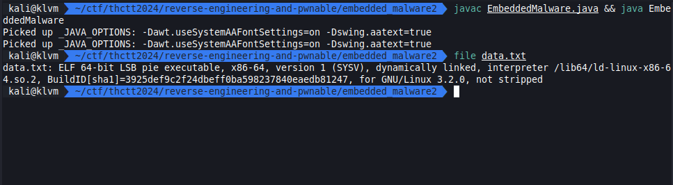

พบว่าคือ ELF file

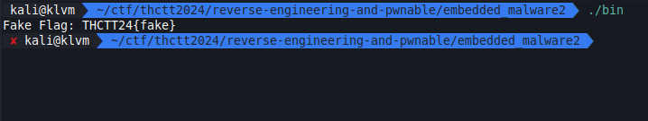

เราจึงลองรันดู อืมมม โดนหลอก ?

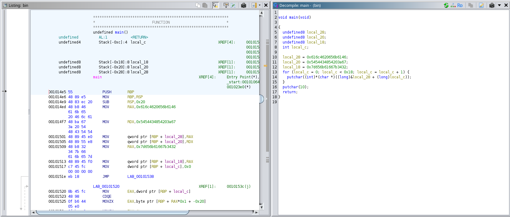

reverse ไปก็ไม่เจออะไรอีก

แต่จากที่เคยเจอถ้ามาทรงนี้มีอะไรแปลกๆซ้อนไว้แน่ๆ

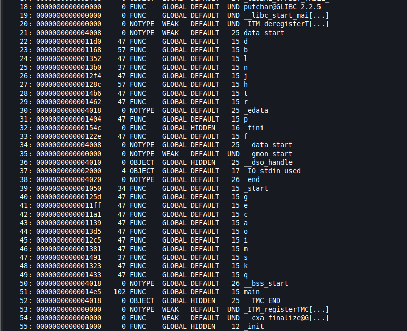

อย่างที่คิด มี function หลายตัวแปลกๆอยู่จริงๆด้วย เพราะชื่อ function พวกนี้ไม่ปกติแถมไม่ถูกเรียกใน main function อีก

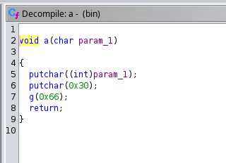

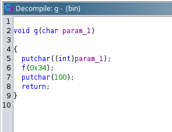

เราจึงลองเปิดดูสักสองตัวพบว่ามัน call ต่อกันเป็น chain และมีการเรียก putchar ซึ่งเราคิดว่าน่าจะเป็น flag ที่ print ออกมาทีละตัว

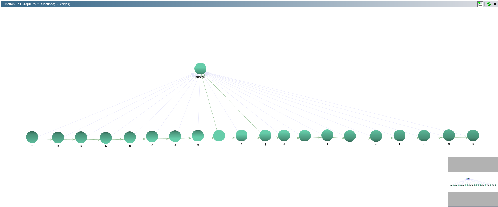

เมื่อเราลองเปิดดู function call graph จากตัวหนึ่งแล้วไล่ดูให้หมด พบว่าต้นทางคือ function n

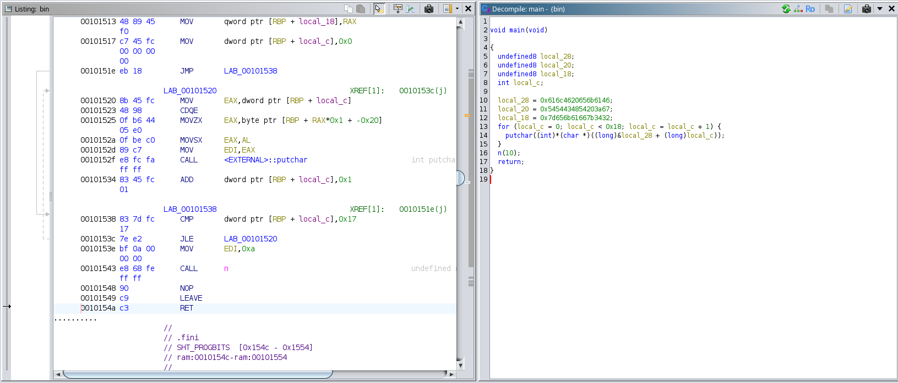

เราจึง patch function ใน main function ตัวหนึ่งให้ไปเรียก function n

## Result

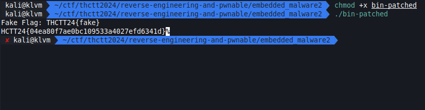

คงไม่ต้องถามหรอกนะว่าตัวแรกที่หายไปใน flag คืออะไร
