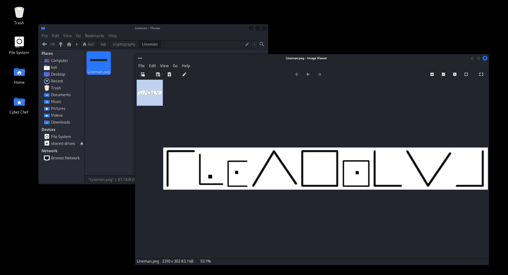
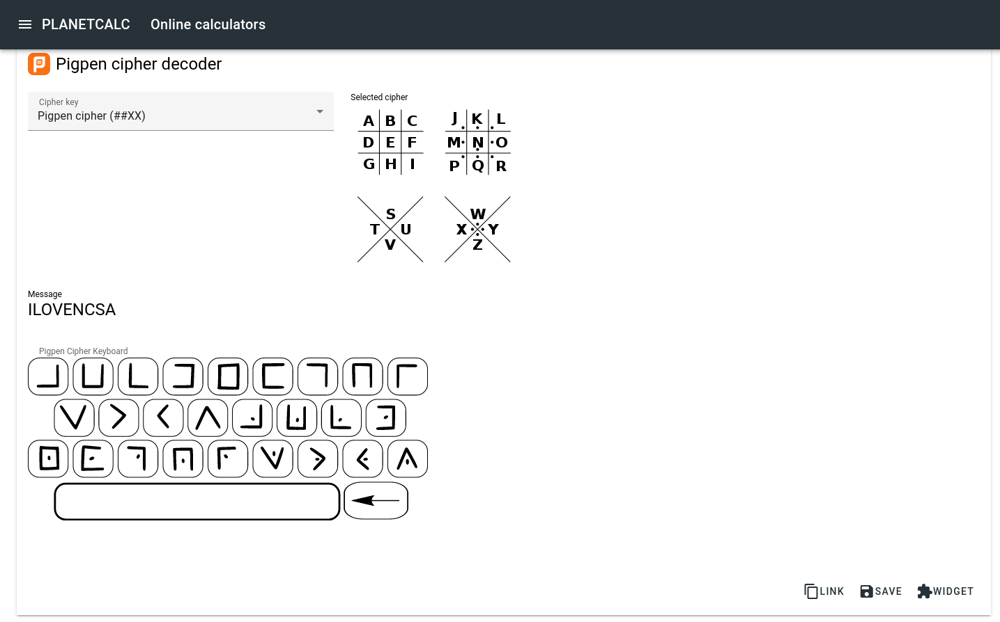

# Lineman

```
.
└── Lineman.txt
```

เราได้รูปๆหนึ่งมา ไม่รู้ว่ามันคืออะไร แต่จริงๆแล้วมันคือ [Pigpen cipher](https://en.wikipedia.org/wiki/Pigpen_cipher)



สิ่งที่เราต้องทำก็แค่ถอดรหัส จากนั้นนำคำที่ได้ไปรวมกับ flag pattern ของงานนี้ `CTT23{xxxxxxxxx}`


