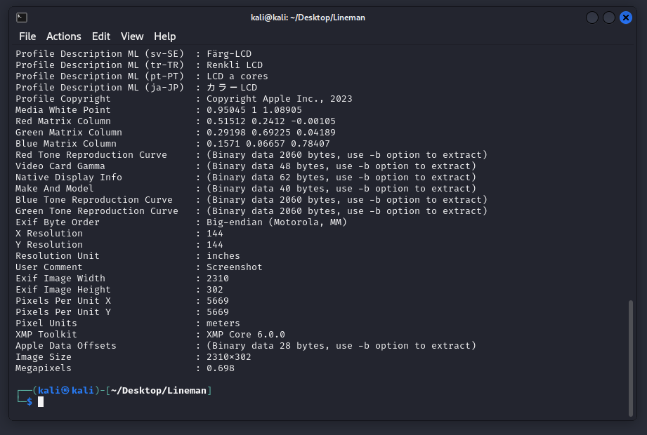
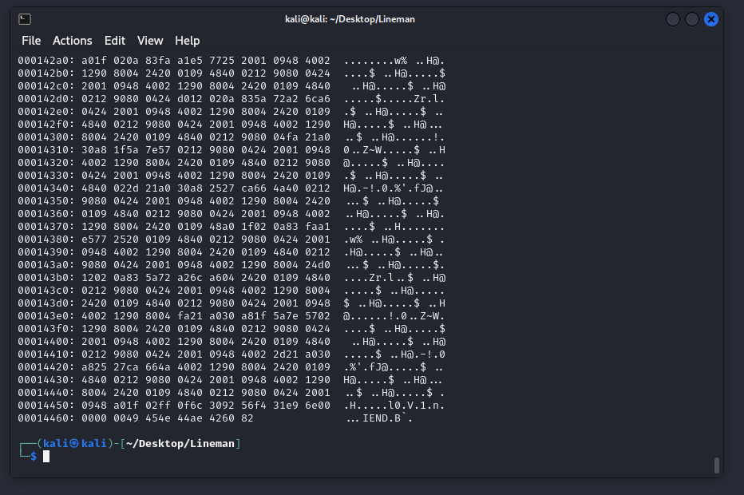
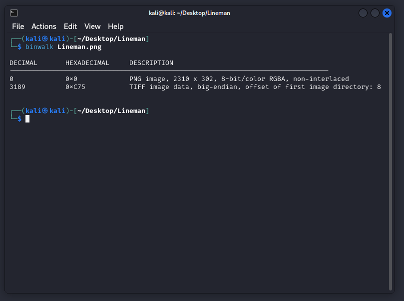
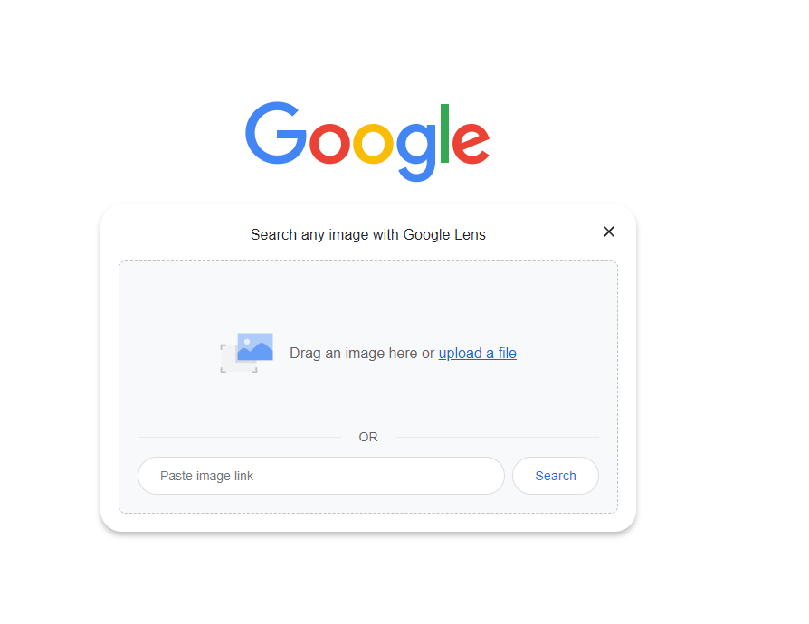
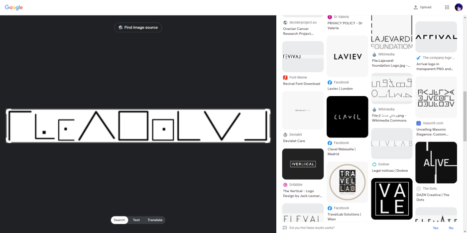
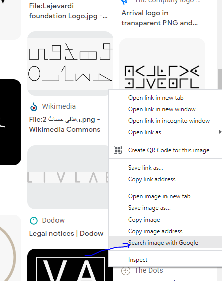
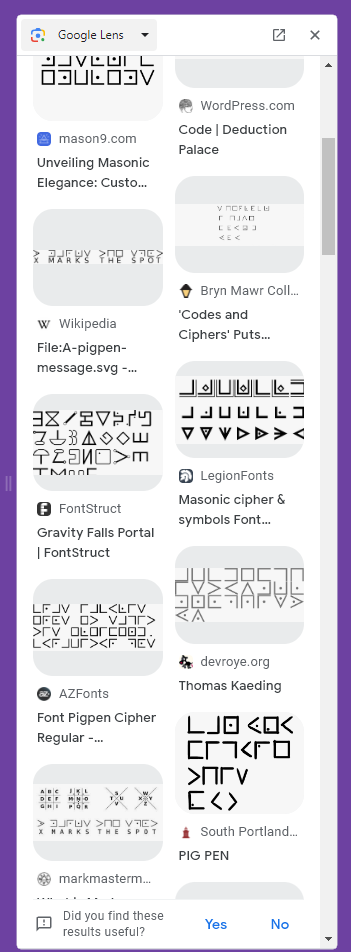
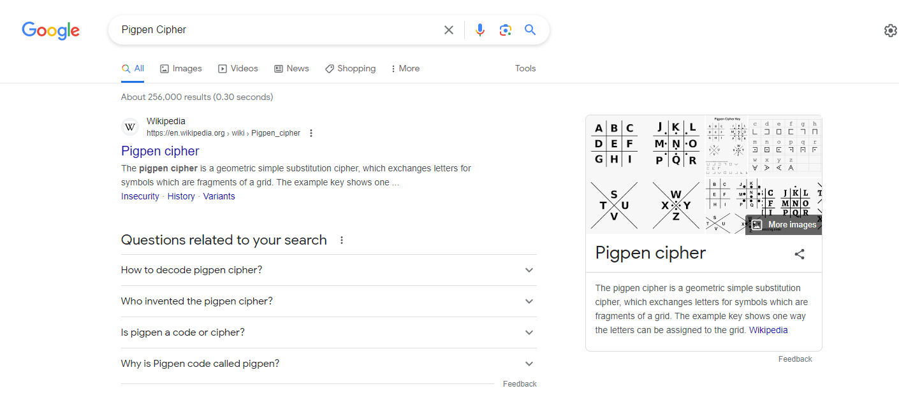
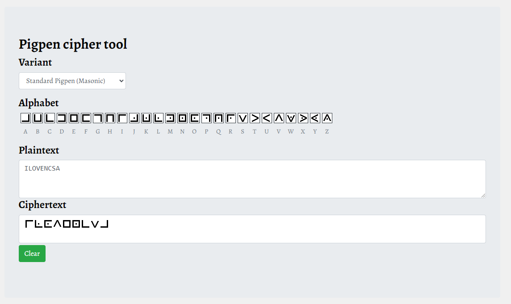

# Lineman

```
.
└── Lineman.png
```

เราได้รูปๆหนึ่งมา ไม่รู้ว่ามันคืออะไร แต่รู้สึกคุ้นๆ เหมือนเคยเห็นที่ไหนมาก่อน


อย่างแรกที่จะทำคือ strings เช็คดูว่า มีอะไรซ่อนไว้หรือเปล่า
```
strings Lineman.png
```


ยังไม่เจออะไรที่ดูแปลกๆ งั้นลอง exiftool
```
exiftool Lineman.png
```


ก็ยังไม่เจอ งั้นลอง xxd
```
xxd Lineman.png
```


ก็ยังไม่เจอ งั้นลอง binwalk
```
binwalk Lineman.png
```


ก็ดูปกติหนิ  จาร้องแล้วนะ  😭😭😭😭 งั้นลอง `Google len` เผื่อจะได้ข้อมูลอะไรเพิ่มเติม




เลื่อนๆ ไป เหมือนจะเจอรูปที่คล้ายๆ กัน



ลองกด `Search image with Google`



พอเลื่อนๆ ไป เราก็จะเจอคำประมาณ `pigpen`, `Pigpen Cipher`



Hm มันคืออะไร! พอเราลองไป Search ดู



เหมือนจะมาถูกทาง งั้นลอง Search `pigpen cipher online decoder` เราก็จะเจอเว็บ สำหรับ decode แล้วเราลอง กดตามภาพที่ได้



นี้มันใช่ ใช่แน่ๆ แต่ Flags จะอยู่ในรูป `CTT23{}` เพราะงั้น Flags ก็จะเป็น `CTT23{ILOVENCSA}` ง่ายใช่ไหมละ 😏😏😏