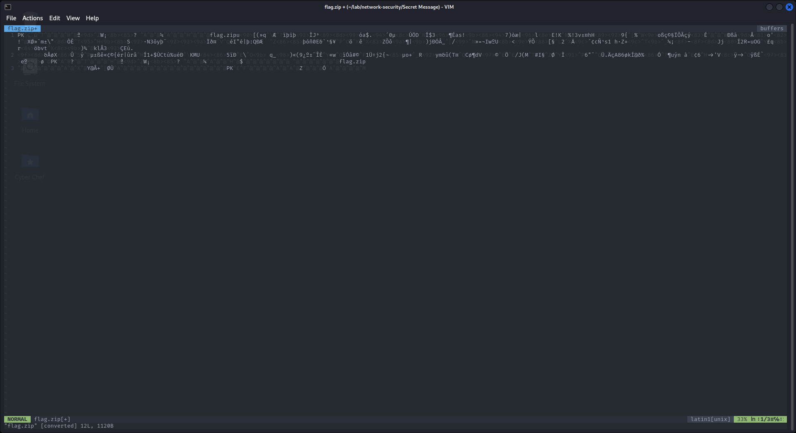
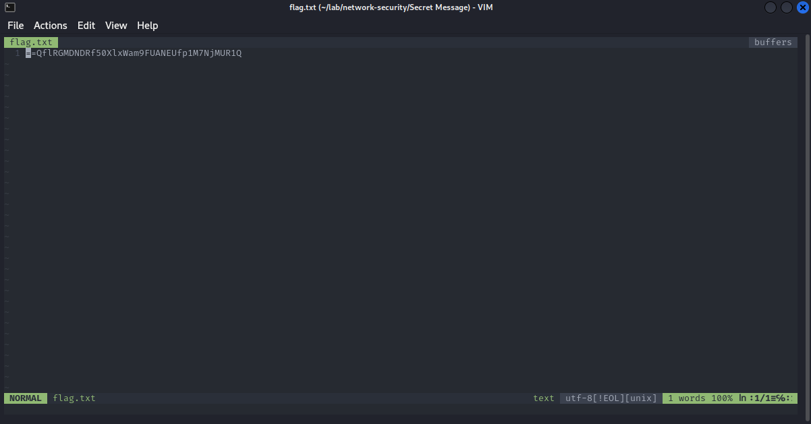
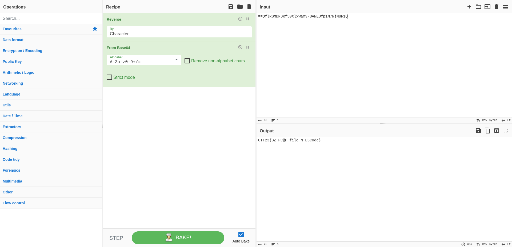

# Secret Message

```
.
└── TheSecretMessage.pcap
```

---

ไฟล์ที่เราได้มาคือไฟล์ pcapng เป็นไฟล์ packet capture สามารถเปิดได้โดยใช้ [Wireshark](https://www.wireshark.org)

เมื่อเราเปิด เราจะเห็นว่ามี packet ไม่กี่อัน และพบกับ HTTP จึงไม่รอช้าที่จะ export HTTP ออกมาดู

- `File > Export Objects > HTTP`


เราได้ไฟล์ `upload.php` มาสองไฟล์ และมีไฟล์หนึ่งที่มีความน่าสนใจ เพราะ HTTP ได้บอกว่ามันคือ zip ไฟล์ และเราจึงดึงเอา data มาเขียนเป็น zip file



จากนั้นเราก็ทำการ extract ไฟล์ออกมา และมันซ้อนกัน เราจึง extract ไปเรื่อยๆจนได้ `flag.txt`



เราได้ text ชุดหนึ่งมา และ pattern นี้ทำให้นึกถึง Base64 แต่มันไม่ใช่เพราะตัว padding มันดันมาอยู่ด้านหน้า จึงเดาๆได้ว่ามันน่าจะเรียงย้อนกลับ เราจึงจับโยนใส่ [CyberChef](https://gchq.github.io/CyberChef/)

- Reverse
- From Base64

และเราก็ได้ flag


