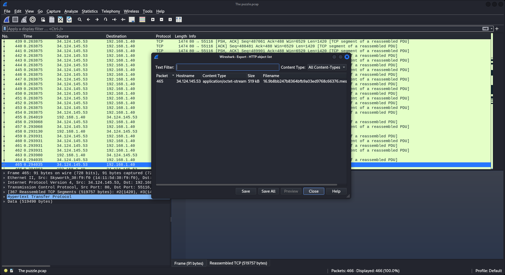
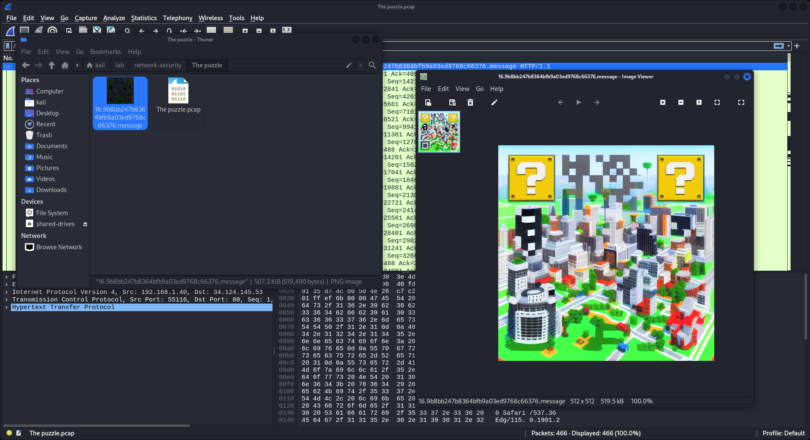
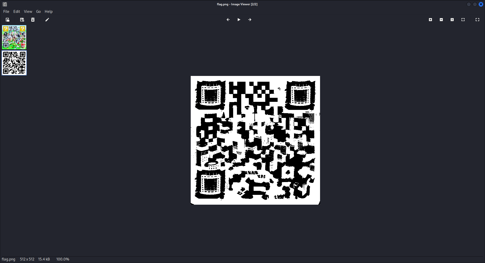

# The puzzle

```
.
└── The puzzle.pcapng
```

---

ไฟล์ที่เราได้มาคือไฟล์ pcapng เป็นไฟล์ packet capture สามารถเปิดได้โดยใช้ [Wireshark](https://www.wireshark.org)


เมื่อเราเปิดขึ้นมาก็พบกับ HTTP Protocol เป็น packet แรก ที่บอกถึงว่ามีการ upload ไฟล์บางอย่าง งานนี้เดาไม่ยากเลยว่าต้องทำอะไร

เราจึงทำการ export HTTP ออกมาดู

- `File > Export Objects > HTTP`



และสิ่งที่เราได้มาก็คือไฟล์ภาพ ที่เป็น QR Code



และเราก็ได้ทำการ scan ดูแล้วพบว่าไม่สามารถสแกนได้ ด้วยสาเหตุง่ายๆคือ QR Code มีรูปแบบไม่ถูกต้อง ในที่นี้คือขาด Position ไป 2 ที่

เราจึงจะทำการแก้ไขภาพโดยการตัดต่อภาพ เราจะใช้โปรแกรมอะไรก็ได้ ในที่นี้เราจะใช้ [GIMP](https://www.gimp.org)

- Colors > Saturation = 0
- Colors > Threshold = Auto (160, 255)



เมื่อเราทำการ export ออกมาแล้ว เราก็ทำการนำมือถือมา scan QR Code ก็จะได้เป็น link `https://bit.ly/ctt23` เมื่อเข้าไปแล้วจะถูก redirect ไปที่ `https://shelldo.000webhostapp.com/flag.txt` อีกที


