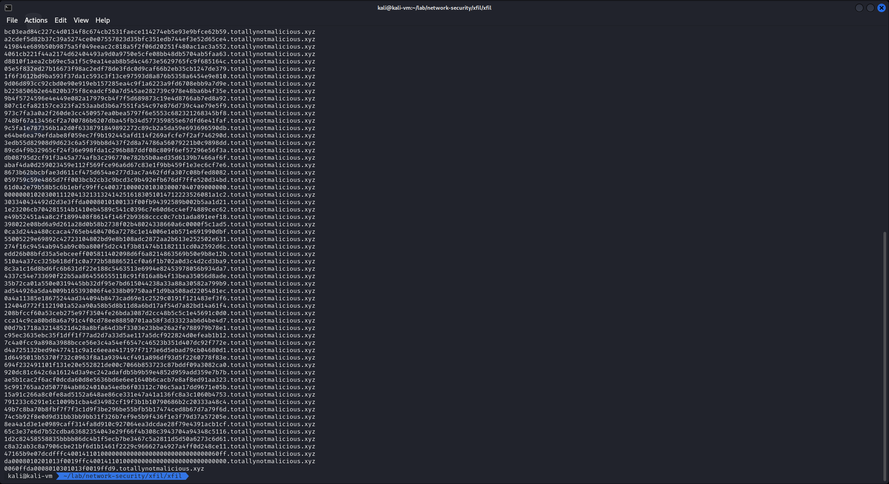

# xfil

```
.
└── xfil
    └── xfil.pcapng
```

---

ไฟล์ที่เราได้มาคือไฟล์ pcapng เป็นไฟล์ packet capture สามารถเปิดได้โดยใช้ [Wireshark](https://www.wireshark.org)


จากภาพเราจะสังเกตุได้ว่า มี dns query จำนวนมากแต่ server ตอบกลับว่า ไม่มีชื่อดังกล่าว

เมื่อเราสังเกตุจะพบว่า subdomain มีความยาวเท่ากันทุกการ query ยกเว้นครั้งสุดท้าย และชื่อ subdomain นั้นเป็นรูปแบบเลขฐาน 16

เราก็คิดว่าพอเอา data (subdomain) ดังกล่าวมาต่อกัน น่าจะเป็นไฟล์

เราจึงนำ 2 bytes แรกไปค้นหาใน [List of file signatures](https://en.wikipedia.org/wiki/List_of_file_signatures) และก็พบว่า มันคือประเภทไฟล์ jpeg

ถึงจุดนี้แล้วไม่ต้องสงสัยแล้วว่ามันคืออะไรนอกจากว่ามันจะคือ ไฟล์รูปภาพ

เราจึงดึง query name เฉพาะที่ client ส่ง ออกมาจากไฟล์ pcap และในไฟล์ pcap นี้ไม่มี packet อื่นที่ไม่เกี่ยวข้องอยู่ เลยไม่จำเป็นต้อง filter อะไรมาก

```sh
tshark -r ./xfil.pcapng -T fields -e dns.qry.name -Y 'ip.src == 172.16.67.130'
```



ลบ domain name ออก แล้วนำมาต่อกันแล้วเขียนเป็นไฟล์

```py
with open('data.jpeg', 'ab') as f:
    try: 
        while True:
            f.write(bytes.fromhex(input().replace('.totallynotmalicious.xyz', '')))
    except EOFError:
        f.close()
```

```sh
tshark -r ./xfil.pcapng -T fields -e dns.qry.name -Y 'ip.src == 172.16.67.130' | python3 script.py
```

และ flag ที่เราตามหาก็จะอยู่ในภาพ `data.jpeg`


