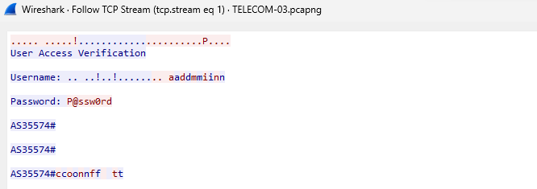

โจทย์ถามว่า username และ password คืออะไร

เปิดมา เราเจอ Telnet เราจึงไม่รอช้าที่จะ `Follow > TCP Stream`

เราก็เจอ username และ password ตอน login แล้วเราก็เขียนในรูป `username:password`

ตอบ `admin:@P@ssw0rd`
