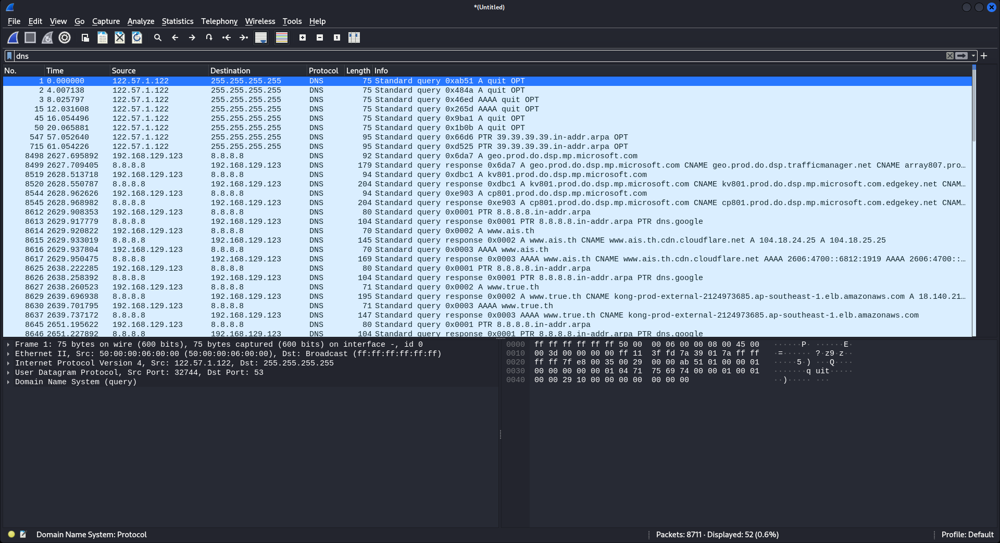
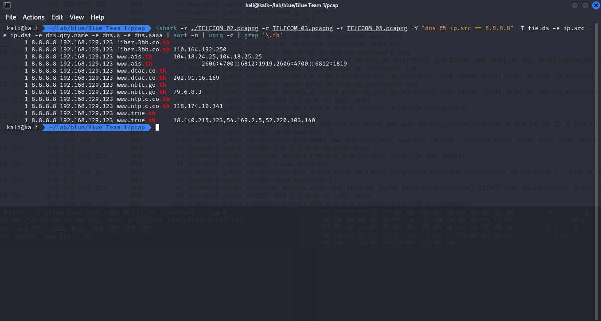

ข้อนี้โจทย์บอกว่า DNS มี domain ที่ถูกจดทะเบียนในไทย ถูกปลอมที่อยู่ IP

โจทย์ถามว่า domain ไหนถูกปลอม IP

ในข้อนี้ เรารวมไฟล์ pcap เพื่อความง่ายในการหาว่ามันอยู่ในไฟล์ไหน เปิดด้วย [Wireshark](https://www.wireshark.org)

```
TELECOM-02.pcapng
TELECOM-03.pcapng
TELECOM-05.pcapng
```

เราจะ filter เอาแค่ dns



เพื่อความง่ายในการดู เราจึง รวมไฟล์แล้วกรองเอา packet ตอบกลับ dns

```sh
tshark -r ./TELECOM-02.pcapng -r TELECOM-03.pcapng -r TELECOM-05.pcapng \
       -Y "dns && ip.src == 8.8.8.8" \
       -T fields -e ip.src -e ip.dst -e dns.qry.name -e dns.a -e dns.aaaa \
       | sort -n | uniq -c | grep '\.th'
```

เราจะได้รายการ ตอบกลับ dns มา



เมื่อนำข้อมูลมาจัดด้วยมือใหม่จะได้ 6 domain ที่เราต้องหาว่าเป็นตัวไหน

```
fiber.3bb.co.th A    110.164.192.250
www.ais.th      A    104.18.24.25,104.18.25.25
www.ais.th      AAAA 2606:4700::6812:1919,2606:4700::6812:1819
www.dtac.co.th  A    202.91.16.169
www.nbtc.go.th  A    79.6.8.3
www.ntplc.co.th A    118.174.10.141
www.true.th     A    18.140.215.123,54.169.2.5,52.220.103.140
```

ณ วันที่ 2023/09/30

นํา IP v4 ที่ได้ไปหาต่อด้วย [ipinfo](https://ipinfo.io/) (logged) โดยเราจะดูว่ามี domain ใน IP นั้นไหม

```
fiber.3bb.co.th
    ASN Name : JasTel Network International Gateway
    Domain   : 3bb.co.th
www.ais.th
    ASN Name : Cloudflare, Inc.
    Domain   : ais.th
www.dtac.co.th
    ASN Name : Total Access Communication PLC.
    Domain   : dtac.co.th
www.nbtc.go.th
    ASN Name : Telecom Italia S.p.A.
    Domain   :
www.ntplc.co.th
    ANS Name : Internet Data Center Service
    Domain   :
www.true.th
    ANS Name : Amazon Technologies Inc.
    Domain   :
```

เราสงสัย `www.nbtc.go.th` `www.ntplc.co.th` `www.true.th`

เราจึงทำการ query dns จาก domain ที่ต้องสงสัย แล้วนำไปหา ASN Name อีกครั้ง

```
www.nbtc.go.th -> Cloudflare, Inc.
www.ntplc.co.th -> Internet Data Center Service
www.true.th -> Amazon Technologies Inc.
````

เราจะเห็นได้ชัดเลยว่า `www.nbtc.go.th` นั้นไม่ตรงกัน จึงสรุปได้เลย

ตอบ `www.nbtc.go.th`
