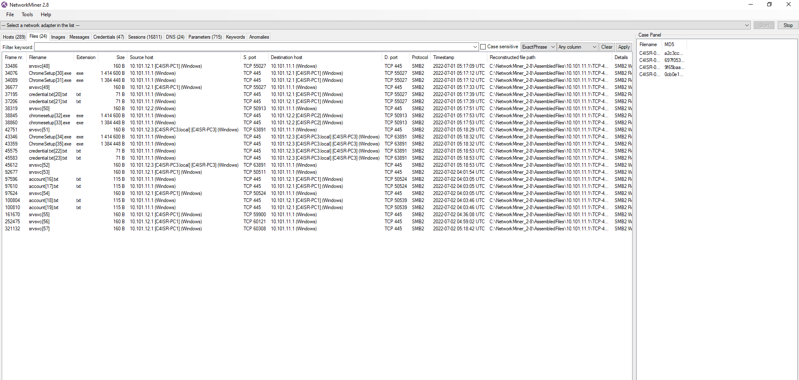

ข้อนี้โจทย์ต้องการทราบ username:password ลำดับที่ 3 ในไฟล์ที่ถูกส่ง

ในโจทย์นี้เรานำไฟล์ pcap มารวมกันทั้งหมด และเราดึงไหล์ด้วย [Network Miner](https://www.netresec.com/?page=NetworkMiner)

```
C4ISR-01.pcap
C4ISR-02.pcap
C4ISR-03.pcap
C4ISR-04.pcap
```



เราลองเปิดไฟล์ไปแล้วพบว่า ไฟล์ `account.txt` นั้นมี username และ password เรียงกันเป็นรายการ 3 ลำดับในหัวข้อ client


ตอบ `user3:P@ssw0rd3`
